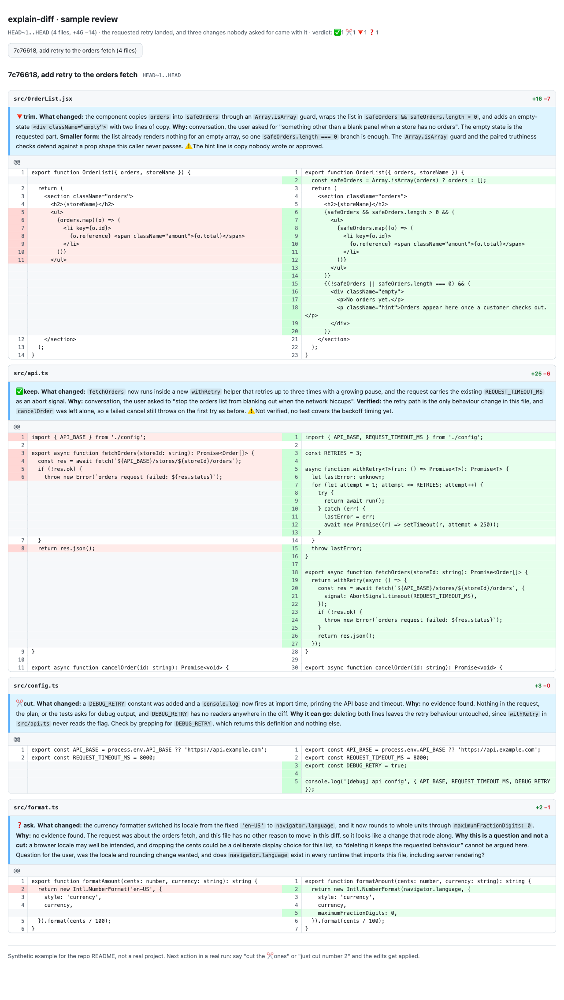

# claude-skills

Claude Code skills I use on my own work. Each one is a working method of mine
written out far enough that an agent can run it: what to look at, in what
order, what to refuse to do, and what the output has to look like. They started
as things I kept repeating in chat, so I moved them into skills and let the
review rounds tighten them.

I am Kyoung Hoon Kim ([studiokyoung](https://github.com/studiokyoung)), a
design engineer. This is the first one that survived contact with real
projects; more follow as they earn it.

## Skills

| Skill | What it is for |
|---|---|
| [`explain-diff`](skills/explain-diff/SKILL.md) | An approval gate for AI-written diffs. Reviews a change hunk by hunk, traces why each part exists, and gives every part a verdict, so the approve-or-not decision takes one read. |

## Install

As a plugin, from inside Claude Code:

```
/plugin marketplace add studiokyoung/claude-skills
/plugin install kyoung@studiokyoung
```

Then invoke it as `/kyoung:explain-diff`. Skills that arrive through a plugin
are namespaced by the plugin name, so `kyoung:` is expected.

If you would rather take the single skill and keep the bare name (this is how I
run it myself), symlink it into your own skills directory:

```bash
git clone https://github.com/studiokyoung/claude-skills ~/claude-skills
ln -sfn ~/claude-skills/skills/explain-diff ~/.claude/skills/explain-diff
```

That gives you `/explain-diff`, and `git pull` updates it in place with no
copies to drift. If the checkout lives outside your project, add it to
`permissions.additionalDirectories` in `~/.claude/settings.json` so the skill's
reference files can be read without prompts.

To try the whole repo without installing anything, point one session at the
checkout:

```bash
claude --plugin-dir ~/claude-skills
```

## explain-diff

### The problem

An agent finishes, and 200 lines are waiting for a yes or no. Reading a diff
tells you what changed, but the question in front of you is a different one:
**why does this hunk exist, and does it deserve to?** Some of what came back is
the thing you asked for. Some of it is a defensive try/catch nobody wanted, a
debug log left behind, a rename that came along for the ride. Approving all of
it is how slop enters a codebase, and reading every line yourself is how the
speed you gained goes back out the door.

### Two axes

Every row of the report answers both:

- **Provenance.** Why this change exists, dug out of the session conversation,
  the plan or task spec it was following, the commit message, the tests that
  moved with it, and the repo conventions, in that order. When nothing supports
  a change, the report says "no evidence found" rather than inventing a reason.
  Fabricating a plausible motive is the failure the skill is written hardest
  against.
- **Verdict.** Whether it has earned its place in the change.

### The output

```
`<range>` (N files, +X −Y) · <one sentence on the whole thing> · verdict: ✅1 ✂️1 🔻1 ❓1

| # | hunk | what | why, and the evidence source | verdict |
|---|------|------|------------------------------|---------|
| 1 | api.ts:42 | adds 3 retries | conversation, user asked to "handle the flaky network" | ✅ |
| 2 | config.ts:3 | debug log at import time | no evidence found, leftover debug log | ✂️ |
| 3 | api.ts:60 | wraps 4 call sites in try/catch | plan asked to harden one call, not four | 🔻 |
| 4 | schema.ts:18 | widens a field to nullable | no evidence found, may be a migration | ❓ |
```

| Verdict | Meaning |
|---|---|
| ✅ keep | Directly tied to the request, and the evidence is clear. |
| ✂️ cut | Unrelated to the request, or slop. Allowed only when deleting it provably leaves the requested behaviour intact. |
| 🔻 trim | Right direction, too much of it. The smaller form is named in one line. |
| ❓ ask | Confidence is 7 or lower out of 10, so no verdict gets made. One question for you instead. |

A row is a logical unit of change, not a physical hunk, so one rename across 12
hunks is one row. Rows that are not `✅ keep` get a short detail block with the
excerpt and the argument for cutting or trimming it. When everything is a keep,
the report is the table plus one line saying so.

It reports and stops. Nothing is edited until you say which rows to apply, on
the theory that a gate which deletes first is not a gate.

### Boundaries

| Tool | Question it answers |
|---|---|
| `/code-review` | Is this **wrong**? Exhaustive correctness bugs. |
| `/simplify` | Can this be **cleaner**? Style and structure, applied. |
| `explain-diff` | **Why is this here, and should it be?** Report only. |

The three do not overlap. If a real bug surfaces while reviewing, it gets
listed separately, capped at three, and handed to `/code-review`, with defects
this diff just created ranked ahead of pre-existing ones.

### The html gate view

Pass `html` and the same review renders as a GitHub-style split diff, one
self-contained local file, with a plain-language note above each file saying
what changed, why, and what was and was not verified. The terminal output
shrinks to three lines. It is the view for a bigger batch, and for handing a
change to somebody who was not in the session.

[](examples/explain-diff/sample-review.html)

The screenshot above is a synthetic four-file example, built to show one of each
verdict. The rendered file is at
[`examples/explain-diff/sample-review.html`](examples/explain-diff/sample-review.html).

### How I use it

I built this because I was approving agent diffs faster than I was reading
them. Now I run it on the working tree before I accept what an agent just
wrote, and the `html` view when the batch is too big for the terminal or when
somebody else has to look at it.

The rule that earns its keep is "no evidence found". A change nothing in the
session asked for is usually the change I would have regretted, and naming that
absence out loud is what makes it visible.

It went through its own gate: reviewing the v2 diff caught an untracked-file
blind spot and an evidence-ladder fallback that skipped the session docs.

## Changelog

- **v2.2** (2026-08-17). Translated to English for publication, and the parked
  polish batch applied: HTML escaping for `<`, `>`, and `&` in note text, the
  filename suffix rule spelled out, and the language rule generalized so the
  review answers in whatever language you prompt in.
- **v2.1** (2026-08-11). The opt-in `html` split-diff view, plus the fixes its
  review rounds turned up.
- **v2** (2026-08-01). The current shape: scope resolution, the evidence
  ladder, the four verdicts, and the report-only rule. Verified against a slop
  fixture and a real project run.

## Credits

The scope normalization, the evidence ladder, and the trace-depth cap in
`explain-diff` started from [yuyeol3/explain-diff](https://github.com/yuyeol3/explain-diff) (MIT).

## License

MIT. See [LICENSE](LICENSE).
