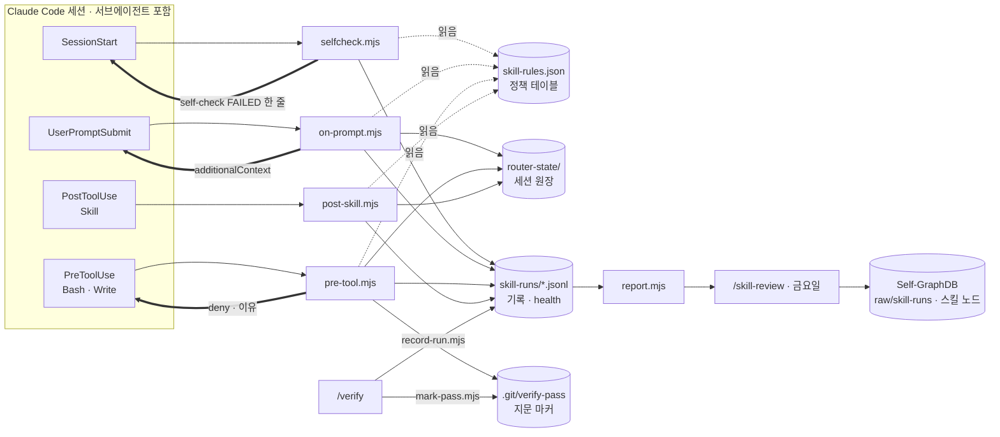
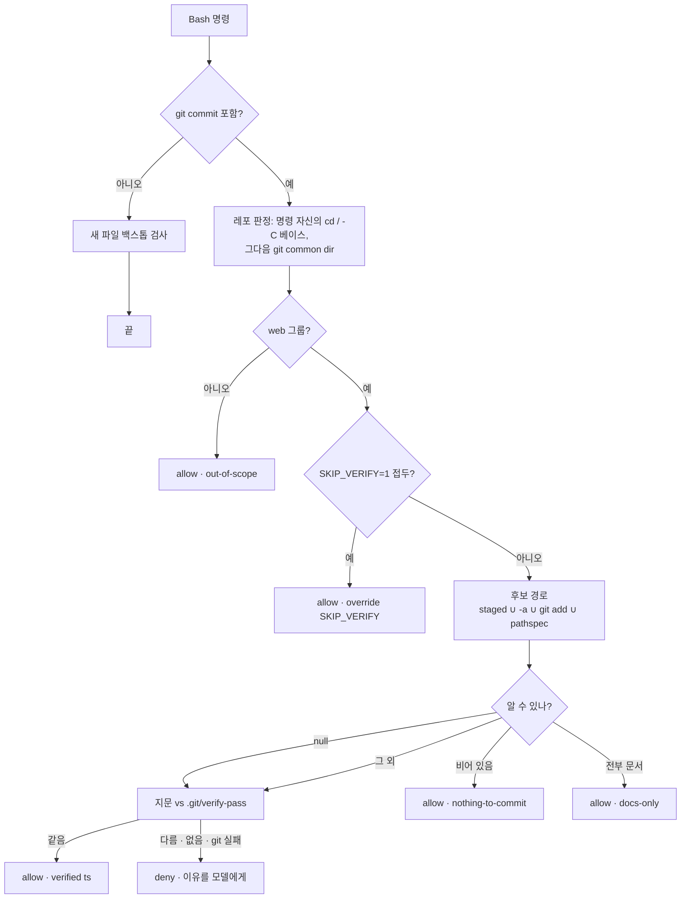

# skill router 가이드

모든 노브와 예외 케이스의 레퍼런스는
[`router/README.md`](../README.md)다. 이 문서는 워크스루다: 세션 안에서
라우터가 실제로 뭘 하고, 어떻게 판정하고, 무엇을 기록하고, 그 기록 더미가
금요일에 어떻게 더 나은 스킬로 바뀌는가.

English: [`GUIDE.md`](GUIDE.md).

---

## 1. 한눈에

**무엇을.** Claude Code 훅 4개 + 정책 테이블 1개로 스킬 발동을 결정론적으로
만든다. 스킬 `description`에 기대는 자동 서페이싱은 확률적이라 긴 세션과
서브에이전트에서 샌다. 훅은 매번 돈다.

**왜.** 카러셀 모바일 버그는 데스크톱만 검증하고 커밋해서 나갔다. "커밋 전에
verify"는 기억이 아니라 기계가 강제해야 한다. 그리고 스킬이 돌 때마다 흔적이
남아야 스킬을 개선할 재료가 생긴다.

**어디에.**

| 것 | 경로 |
|---|---|
| 코드 | `~/claude-skills/router/` |
| 정책 | `router/skill-rules.json` |
| 세션 상태 | `~/.claude/router-state/` |
| 기록 | `~/.claude/skill-runs/` |
| 등록 | `~/.claude/settings.json` |

**라이브**: 2026-09-01 02:13 UTC부터 훅 3개, 05:41 UTC 재설치에서 네 번째
(`SessionStart`)가 합류했다. 이후 모든 새 세션이 훅 4개를 다 돈다.

스크립트는 스킬 이름도, 레포 이름도, 정규식도 하드코딩하지 않는다. 정책은
`skill-rules.json` 한 파일뿐이고 스크립트는 그 테이블을 읽어 실행만 한다.
스킬 하나를 더 태우는 일 = 테이블에 줄 하나.

---

## 2. 사용법

### 2.1 게이트 레포에서 커밋하기

적용 레포는 `repo_groups.web`에 적힌 이름들이다 (예: `your-portfolio`,
`client-site-a`). 이 그룹은 빈 채로 배포되니 `skill-rules.json`에 직접 적거나,
이름을 git에 남기고 싶지 않으면 옆에 둔 gitignore된 `skill-rules.local.json`에
적는다 (둘은 로드 시점에 병합된다. [../README.md](../README.md)의 룰 테이블 절
참고). 그 외 레포에선 커밋 게이트가 아예 개입하지 않는다.

1. **작업한다.** 편집도 스테이징도 자유. 게이트는 커밋 순간에만 본다.
2. **`/verify`를 돌린다.** git 상태 → 타입체크 → 테스트 → 3뷰포트 스크린샷
   (모바일 앱이면 스크린샷 대신 리포의 maestro 플로우)을 실행하고 표를 찍은 뒤, 판정이 *safe*면 `.git/verify-pass`에 방금 검증한
   트리의 지문을 쓴다. not-safe면 기존 마커를 지운다. 어느 쪽이든 런 기록
   한 줄이 남는다.
3. **`git commit`.** PreToolUse 훅이 명령을 읽고 지문을 다시 계산해 마커와
   비교한다. 같으면 조용히 통과, 다르면 거부하고 이유가 모델에게 돌아간다.
   verify 뒤에 `git add`만 한 건 변경이 아니다. 지문은 스테이징에 중립이다.
4. **거부됐다면** 트리를 고치고 `/verify`를 다시. 의식적으로 건너뛰려면
   `SKIP_VERIFY=1 git commit -m "..."`. 명령 **앞**의 환경변수 대입만
   인정되고, 커밋 메시지 안에 써 봤자 안 먹는다. 이유는 메시지에 적는다.

| 상황 | 판정 | 로그의 `why` |
|---|---|---|
| 게이트 레포가 아님 | allow | `out-of-scope` |
| `SKIP_VERIFY=1` 접두 (세그먼트 시작) | allow | `override SKIP_VERIFY` |
| 커밋에 들어갈 파일이 없음 | allow | `nothing-to-commit` |
| 들어갈 파일이 전부 `.md/.mdx/.txt/.markdown` | allow | `docs-only` |
| 마커 지문 = 지금 트리 지문 | allow | `verified <ts>` |
| 마커 없음 | deny | `marker missing` |
| verify 뒤에 트리가 바뀜 | deny | `tree changed since <ts>` |
| git이 실패해 지문을 못 냄 | deny | `fingerprint unavailable (git failed)` |
| 후보 집합을 알 수 없음 (명령 치환 등) | 지문 검사로 흘러감 | 위 넷 중 하나 |

모델이 받는 거부 문장 그대로(룰 테이블에선 한 줄, 여기선 폭에 맞춰 접었다):

```
verify gate: no passing /verify for this exact tree (marker missing). Run the
verify skill first, then commit. Conscious override: SKIP_VERIFY=1 git commit
... (say why in the commit message).
```

훅은 서브에이전트의 툴콜에도 적용되므로 "워커가 표만 그려놓고 커밋"은
기계적으로 막힌다.

### 2.2 리마인드

프롬프트가 들어오는 순간(UserPromptSubmit) `prompt` 룰을 프롬프트 앞
4000자에 대조하고, 맞으면 모델 컨텍스트에 한 줄을 넣는다. 사용자에겐 안
보이고 모델만 읽는다. 이것도 실제로는 한 줄이고, 여기선 폭에 맞춰 접었다:

```
[skill-router] This prompt asks to build a component/hook/util/feature. Invoke
the reuse-scout skill FIRST and cite its manifest before designing or writing
code: the repo probably already has part of this.
```

- **reuse-scout** (모든 레포). "버튼 컴포넌트 하나 만들어줘",
  "add a useDebounce hook", "결제 화면에 로딩 상태 추가해줘" 같은 문장.
  한국어 명사-먼저와 영어 동사-먼저를 둘 다 본다. 단어 경계와 가드가 있어서
  "the build is failing on the login page", "이 화면도 추가로 확인해줘"엔 안
  걸린다. 세션당 1회, 이미 reuse-scout를 돌렸으면 침묵.
- **백스톱.** 리마인드를 놓쳤어도, `components/ hooks/ lib/ utils/ modules/
  app/ screens/ features/` 아래에 **없던 파일**을 Write하거나 `>` / `>>` /
  `tee`로 만들려는 순간 한 번 더 알린다. 차단 없이 컨텍스트 주입.
  `~`로 시작하거나 `$`가 든 타깃은 미확장 셸 텍스트라, 세션의 1회분을
  태우지 않고 건너뛴다.
- **save-memory** (Corp 레포만). "오늘은 여기까지, 정리하자",
  "let's wrap up" 류. `마감일` 가드가 사는 곳이 여기라서 "이번 스프린트
  마감일 언제야?"엔 안 걸린다. 세션당 1회, 이미 돌았으면 침묵.
- **자기-에코 가드.** 프롬프트에 `[skill-router]`가 들어 있으면 룰을 아예
  평가하지 않는다. 리마인드 문구가 다시 패턴에 걸려 세션의 1회분을 태우는
  걸 막는다.
- **하네스 턴 가드.** `<task-notification>`이나 `<system-reminder>`로
  시작하는 프롬프트, 앞 200자에 `[SYSTEM NOTIFICATION - NOT USER INPUT]`가
  든 프롬프트도 평가하지 않는다. 백그라운드 작업이 뱉은 문장이 세션의
  1회분을 태우거나, 아무도 타이핑하지 않은 invoke를 남기는 걸 막는다.

### 2.3 런 기록

`~/.claude/skill-runs/<skill>.jsonl`에 JSON 한 줄씩 append. 제자리 수정은
없다. 타입 5개 + 라우터 자기 버퍼의 `health`. 아래 줄은 전부 이 가이드를
쓰면서 **임시 `SKILL_RUNS_DIR`에 실제로 찍어낸** 기록이다.

리마인드가 나가면, 그 리마인드가 요청한 스킬의 버퍼에 룰 id, 패턴 인덱스,
프롬프트 발췌가 들어간다.

```json
{"type":"remind","rule":"reuse-scout-prompt","delivery":"prompt","repo":"portfolio-html","session_id":"5f5e2a91","prompt_id":"p-01","pattern_index":1,"prompt_excerpt":"버튼 컴포넌트 하나 만들어줘","id":"reuse-scout-20260901T055632Z-79e8","ts":"2026-09-01T01:56:32.317-04:00","skill":"reuse-scout"}
```

모델이 그 스킬을 돌리면 `Skill` 훅이 트리거를 분류한다. `router`는 이 세션에
그 스킬 리마인드가 먼저 나갔다는 뜻이다.

```json
{"type":"invoke","repo":"portfolio-html","session_id":"5f5e2a91","prompt_id":"p-02","trigger":"router","id":"reuse-scout-20260901T055632Z-ec62","ts":"2026-09-01T01:56:32.576-04:00","skill":"reuse-scout"}
```

마커 없이 커밋이 들어온다. `candidates`는 그 커밋이 실어 갔을 경로 수다.

```json
{"type":"gate","repo":"portfolio-html","session_id":"5f5e2a91","prompt_id":"p-03","decision":"deny","why":"marker missing","candidates":1,"docs_only":false,"marker_ts":null,"marker_age_s":null,"command_excerpt":"git commit -m \"feat: toast\"","id":"verify-20260901T055632Z-76e5","ts":"2026-09-01T01:56:32.788-04:00","skill":"verify"}
```

`/verify`가 끝나면서 `record-run.mjs`로 자기 줄을 쓴다. 스킬 버전과, 끝난
시점의 git 컨텍스트가 함께 박힌다.

```json
{"type":"run","version":"1.1.0","repo":"portfolio-html","cwd":"/.../repos/portfolio-html","session_id":"5f5e2a91","session_inferred":true,"prompt_id":null,"git":{"head":"90f88bb81da4","branch":"main","changed":1},"outcome":{"verdict":"safe","gates":{"git":"PASS","typecheck":"PASS","tests":"PASS","screenshots":"PASS"},"tiles":9,"routes":["/"],"duration_s":84},"caught":[],"id":"verify-20260901T055634Z-5504","ts":"2026-09-01T01:56:34.204-04:00","skill":"verify"}
```

같은 커밋을 다시. `marker_age_s`가 통과시킨 verify와 커밋 사이의 간격이다.

```json
{"type":"gate","repo":"portfolio-html","session_id":"5f5e2a91","prompt_id":"p-05","decision":"allow","why":"verified 2026-09-01T01:56:33.615-04:00","candidates":1,"docs_only":false,"marker_ts":"2026-09-01T01:56:33.615-04:00","marker_age_s":1,"command_excerpt":"git commit -m \"feat: toast\"","id":"verify-20260901T055634Z-fe57","ts":"2026-09-01T01:56:34.664-04:00","skill":"verify"}
```

나중에 `debrief`가 그 런이 놓친 걸 찾아 `ref`로 가리킨다. 원본 런은 절대
고치지 않는다.

```json
{"type":"annotation","ref":"verify-20260901T055634Z-5504","repo":"portfolio-html","missed":"carousel mobile overflow","by":"debrief 2026-09-02","note":"tiles were desktop-only","id":"verify-20260901T055635Z-62d0","ts":"2026-09-01T01:56:35.158-04:00","skill":"verify"}
```

그리고 세션이 시작되거나 재개될 때마다 셀프체크가
`~/.claude/skill-runs/router.jsonl`에 `health` 한 줄을 쓴다. 스킬 버퍼가
아니라 라우터 자신의 버퍼다.

```json
{"type":"health","ok":true,"checks":{"settings":true,"rules":true,"probe.on-prompt":true,"probe.pre-tool":true,"probe.post-skill":true,"node":true},"ms":449,"node":"v22.14.0","router_dir":"/Users/kyounghoonkim/claude-skills/router","id":"router-20260901T055636Z-a30a","ts":"2026-09-01T01:56:36.126-04:00","skill":"router"}
```

**조인 키.** `remind`·`invoke`·`gate`·`run`엔 `session_id`와 `prompt_id`가
있어서 서로 다른 버퍼가 붙는다. 같은 `session_id` 안에서 `remind` 뒤에 같은
스킬의 `invoke`가 오면 전환된 리마인드다. **`annotation`과 `health`엔 둘 다
없다.** annotation은 `ref`로 런을 가리키고, health는 세션이 아니라 라우터
자신의 줄이다. `id`는 모든 줄이 갖는 자기 식별자. `ts`는 오프셋 붙은 로컬
시간이고 `router.log`는 UTC라, 둘을 변환 없이 섞으면 한 시간 차이가 동시로
보인다.

**프라이버시.** 프롬프트 발췌는 공백을 접은 앞 **160 코드포인트**, 명령
발췌는 같은 방식으로 **120 코드포인트**, 프롬프트 전문은 절대 저장하지
않는다. 기록은
`~/.claude/skill-runs/` 아래에만 있고 레포엔 안 들어가며 기기 밖으로 안
나간다. `/verify`가 레포 안에 쓰는 건 git이 무시하는 `.git/verify-pass`
하나뿐이다.

### 2.4 세션 셀프체크

`selfcheck.mjs`는 `SessionStart`에서, 세션이 **시작되거나 재개될 때** 돌면서
로그가 답할 수 없는 질문에 답한다: 라우터가 아직 물려 있고, 아직 발동하는가.
`/clear`와 압축은 같은 세션 안에서 `SessionStart`를 다시 쏘는 것이고 그 사이
설치가 바뀔 수 없으므로 그 둘만 건너뛴다: 프로브도, `health` 기록도, 로그
줄도 없다. 나머지 source는 라우터가 모르는 값이라도 전부 돈다(여기서
허용목록을 쓰는 게 체크가 조용해지는 방법이니까). 체크 6개, 약 0.5초, 다
통과면 침묵.

| 체크 | 증명하는 것 |
|---|---|
| `settings` | `settings.json`이 파싱되고, 훅 4개가 **이 체크아웃에서** 등록돼 있고, `allow_skills` 이름이 전부 허용돼 있고, `env.SKILL_RUNS_DIR`가 있음 |
| `rules` | 테이블이 로드되고, 리마인더 룰마다 메시지가 있고, 룰이 부르는 그룹이 실재하고, `pretooluse_context`가 두 값 중 하나임 |
| `probe.on-prompt` | 프롬프트 훅이 reuse-scout 룰 자신의 `sample` 문장을 아직 리마인드로 바꿈 |
| `probe.pre-tool` | `components/` 아래 새 파일이 아직 백스톱을 부르고, 게이트 레포의 미검증 커밋이 아직 거부됨 |
| `probe.post-skill` | `Skill` 호출이 아직 세션 원장에 남음 |
| `node` | Node 22 이상. informational이라 기록되고 카운트되지만 판정은 절대 뒤집지 않는다. Node가 낡았다고 라우터가 깨진 건 아니니까 |

프로브 셋은 임시 `HOME`, 임시 상태/기록 디렉토리, 임시 git 체크아웃에
`SKILL_ROUTER_PROBE=1`을 걸고 **진짜 훅 스크립트를 스폰**한다. 그래서 프로브가
진짜 기록을 쓸 수도, 체크에 재진입할 수도 없다. 스폰 4개는 병렬이고, 그게
세션 시작 예산 안에 들어가는 이유다. 그 임시 체크아웃을 만드는 것 자체가
실패할 수도 있는데(git이 없거나, 실패하거나, timeout에 걸리거나), 그때
`probe.pre-tool`은 커밋 게이트가 깨졌다고 보고하지 않고 **체크아웃을 못
만들었다**고 말한다. 이 체크가 절대 만들어내면 안 되는 경보가 그거다.

전부 통과: stdout 무출력, `health` 기록 한 줄, 로그 한 줄. **블로킹 실패**:
실패한 체크와 이유를 담은 한 줄이 세션에 들어가고, 같은 목록이 기록에도
남는다. **노트만 있을 때**(뒤에 블로킹이 없는 `node` 같은 informational
체크)는 기록에 `informational` 표시로 남고 주간 리포트의 Health에 카운트되지만,
세션엔 안 들어가고 판정도 `ok`로 남는다.

```
[skill-router] self-check FAILED: settings (PostToolUse: post-skill.mjs not
registered). Run /skill-router status; repair with /skill-router install.
```

같은 체크를 표로 보고 싶을 때. 블로킹 실패가 있으면 exit 1, 노트만 있으면
`PASS` 아래에 `⚠️` 줄이 찍히고 exit 0.

```bash
node ~/claude-skills/router/selfcheck.mjs --cli
```

```
router self-check · /Users/kyounghoonkim/claude-skills/router · v22.14.0
✅ settings          4 hooks, 7 allow rules, SKILL_RUNS_DIR set
✅ rules             4 rules, 2 groups, additionalContext
✅ probe.on-prompt   reuse-scout-prompt reminded
✅ probe.pre-tool    new-file reminder + commit deny in portfolio-html
✅ probe.post-skill  verify invocation ledgered
✅ node              v22.14.0
PASS · 6 checks · 471ms
```

**수리는 명시적으로.** 체크가 실패해도 `settings.json`을 스스로 고치지
않는다. `/skill-router install`을 돌리라고 말할 뿐이다. 이유 둘: 세션 중에
설정 파일을 고치는 훅은 다음 세션이 뭘 돌릴지를 조용히 바꿔버리는 훅이고,
설정 변경은 어차피 새 세션부터 먹으므로 자동 수리는 그걸 발견한 세션에서
아무것도 고치지 못한다. `SKILL_ROUTER_SELFCHECK=0`으로 세션 단위로 끌 수 있다.

### 2.5 금요일 의식: `/skill-review`

감지는 자동, 강화는 결정이다. 주 1회, 숫자를 보면서 내린다. 결정론적인 절반이
`report.mjs`다.

```bash
node ~/claude-skills/router/report.mjs                                  # 마크다운, 지난 리뷰 이후
node ~/claude-skills/router/report.mjs --since 2026-08-25T00:00:00Z --json
node ~/claude-skills/router/report.mjs --mark                           # 창을 닫고 그것만 출력
```

창은 `~/.claude/router-state/review-watermark.json`의 `last`부터, 없으면 지난
7일. `--since`가 둘 다 덮는다. `--mark`는 워터마크를 지금으로 쓰고 방금 대체한
값을 찍는다.

위에서 만든 임시 버퍼로 실제로 돌린 리포트:

```
# skill router · weekly review
window 2026-08-25T05:56:42.908Z → 2026-09-01T05:56:42.908Z · 7 days · window from default · 8 records

totals · invoke 2 · remind 1 · run 1 · gate 2 · annotation 1

## reuse-scout
- invoke 1 · user 0 · router 1 · model 0
- remind 1 · converted 1 (100%)
  - reuse-scout-prompt: 1 sent, 1 converted

## verify
- invoke 1 · user 1 · router 0 · model 0
- run 1 · safe 1
  - version 1.1.0: 1 run · safe 1
  - gates.git: PASS 1
  - gates.typecheck: PASS 1
  - gates.tests: PASS 1
  - gates.screenshots: PASS 1
  - sums tiles 9 · duration_s 84
- gate 2
  - allow: verified 1
  - deny: marker missing 1
  - deny to allow cycles 1 · median marker age at allow 1s · median denies before the first allow 1 (a session that was never denied counts 0)
- annotation missed: carousel mobile overflow (ref verify-20260901T055634Z-5504, by debrief 2026-09-02)

## Candidates
- pattern-unused · reuse-scout-prompt #0 · (?:\b(?:re)?build\b(?!\s*(?:(?:is|was|isn|fails?|failing|fai

## Health
- self-check 1 ok · 0 failed
```

저 출력에서 볼 두 가지. allow 버킷이 `verified 2026-09-01T01:56:33.615-04:00`이
아니라 `verified 1`이다. 게이트는 마커의 타임스탬프를 이유에 그대로 쓰기
때문에, 리포트가 뒤에 붙은 ISO 타임스탬프를 떼고 버킷을 만든다. 안 그러면
커밋마다 버킷이 하나씩 생겨 그 열 전체가 노이즈가 된다. 그리고
`pattern-unused`가 패턴 #0에 대해 떴는데, 샘플 프롬프트가 패턴 #1에 걸렸기
때문이다. 그게 정확히 이 후보가 잡으라고 있는 신호다.

`Health` 절은 셀프체크 이력을 센다. 통과한 기록에 얹혀 온 informational
체크도 거기서 따로 한 줄로 세어지므로, 아무도 안 보는 노트가 영영 안 고쳐지는
일이 없다:

```
## Health
- self-check 1 ok · 0 failed
  - notes: node 1
```

`Candidates`는 의견이 아니라 임계값 통과다.

| 종류 | 언제 뜨나 |
|---|---|
| `rule-never-converts` | 룰이 3회 이상 리마인드했는데 그 뒤로 스킬이 한 번도 안 돎 |
| `gate-loop` | 한 세션이 3회 이상 거부됐는데 게이트가 요구한 스킬의 `invoke`도 `run`도 없음 |
| `self-echo` | 이미 그 스킬의 슬래시 명령인 프롬프트에 리마인드가 발동 |
| `pattern-unused` | `prompt` 패턴이 창 내내 아무것도 매치 못 함 (그 룰의 스코프에 실제로 들어간 창에서만) |
| `version-regression` | 한 버전이 3런 이상에서 `safe`보다 `not-safe`가 많음 |

`/skill-review`는 사람 쪽 절반이고, 순서는 이렇다.

1. `selfcheck --cli`. FAIL이면 리뷰를 **멈춘다.** 안 돌던 훅은 기록을 안
   남겼고, 없는 기록은 "조용한 주"로 읽힌다. 정확히 반대 결론이다.
2. `report.mjs --md`를 판단 한 줄 쓰기 전에 **통째로** 읽는다.
3. 스킬마다 두 문장의 독해, 그리고 후보 표. 모든 "why" 칸은 리포트의 숫자를
   인용한다. 제안만 하고, `SKILL.md`나 `skill-rules.json`을 스스로 고치지
   않는다.
4. Self-GraphDB 그래프 쓰기: 이번 창의 새 기록 줄을 `id` 기준 dedupe해
   `raw/skill-runs/<skill>.jsonl`에 append, 트래킹 스킬마다
   `graph/projects/<skill>-skill.md` 노드(현재 상태 블록은 제자리 개정,
   강화 이력은 날짜 불릿 1개 append), 허브 `graph/projects/claude-skills.md`와
   그 허브를 가리키는 인바운드 링크 1줄(고아 방지), 새 노드마다 `INDEX.md`
   한 줄, `log.md` 항목 1개. raw 쓰기는 append-only이고, `wc -l`이 정확히
   추가한 줄 수만큼 늘었는지로 증명한다.
5. 리뷰가 실제로 끝난 뒤에만 `report.mjs --mark`.

**스킬 계층에서 그래프에 쓰는 주체는 금요일의 Kyoung + 이 스킬뿐이다.**
v1에 스케줄 루프는 없다. 누락이 아니라 결정이다: 자동 메모리 쓰기는 모델
재량이라 조용히 건너뛰어지고, 사람이 트리거하는 의식이 아무도 멈춘 걸
모르는 자동 루프보다 신뢰도가 높다. 자동이어야 하는 건 **감지**다. 그게
그냥 두면 조용히 죽는 쪽이니까.

`/save-memory`는 마지막에 이 의식을 가리키고, 자기 `run` 줄을 남기며 끝난다.
스킬 계층의 기억은 오토메모리 파일이 아니라 이 기록들과 금요일 리뷰다.

### 2.6 운영 콘솔: `/skill-router`

읽기 전용 프로그램 두 개가 **그 턴에** 찍은 것만 보고한다.

| 서브커맨드 | 무엇을 읽나 |
|---|---|
| (없음), `status` | `status.mjs --md` 다음 `selfcheck.mjs --cli` |
| `log [n]` | `~/.claude/router-state/router.log`. 1 MB에서 `router.log.1`로 회전하므로, 멀리 거슬러 가는 창은 둘 다 필요 |
| `rules` | 상태 카드의 룰 블록, 정규식 원문이 필요하면 `skill-rules.json` |
| `records [skill]` | 카드의 타입별 카운트, 그다음 `<runs dir>/<skill>.jsonl` 꼬리. 디렉토리는 짐작하지 말고 상태 카드에서 가져온다 |
| `why-denied` | 두 로그 파일의 `commit` + `deny` 줄을 다음 행동으로 해독 |
| `install` / `uninstall` | 먼저 `install.mjs --dry-run`, 명시적 yes 뒤에만 실행 |
| `doc` | 이 가이드, 영어판, `router/README.md` |

```bash
node ~/claude-skills/router/status.mjs --md
node ~/claude-skills/router/status.mjs --json --cwd ~/portfolio-html --log 20
```

`status.mjs`는 **아무것도 쓰지 않는다.** 디렉토리조차 안 만든다. 보고하는
것: 훅 4개가 있는지 없는지와 **실제로 어느 체크아웃에서 도는지**(파일에 훅이
있는지만 보는 점검이 놓치는 실패다), 기대되는 allow 룰과 그 외
`Skill(...)` allow의 개수, 룰 테이블 한 줄씩, 이 레포의 이름과 `pre-commit`
룰이 덮는지 여부와 마커의 나이, 회전 파일까지 걸친 로그 꼬리, 타입별 기록
파일, 마지막 셀프체크.

### 2.7 노브 · 진단 · 한계

| 하고 싶은 것 | 명령 / 파일 |
|---|---|
| 설치 상태만 확인 | `node ~/claude-skills/router/install.mjs --dry-run` |
| 끄기 / 다시 켜기 | `install.mjs --uninstall` / `install.mjs` (설정 백업 먼저) |
| 게이트 레포 추가·제거 | `router/skill-rules.json`의 `repo_groups.web`에 디렉토리 basename 한 줄 |
| 리마인드 문장 추가 | 같은 파일의 룰 `patterns` (대소문자 무시, 유니코드), 그다음 스위트 |
| 스킬이 조용해졌을 때 | `~/.claude/router-state/router.log`, 6열: `ts · event · rule · repo · decision · why`. 1 MB에서 `router.log.1`로 회전 |
| 캐너리 돌리기 | `cd ~/claude-skills && node --test 'router/test/*.test.mjs'` |

글롭은 따옴표로 감싼다. 맨 디렉토리 형태는 Node 22가 모듈 경로로 읽어서
아무것도 안 돌고 실패한다.

**게이트가 못 보는 것.** git이 자기 명의로 만드는 커밋(`revert`, `merge`,
`cherry-pick`, `rebase --continue`, `stash`), 스크립트나 npm 타깃 안의 커밋,
파서에서 명령을 숨기는 래퍼(`timeout`, `bash -c`, `eval`, `xargs`, git 별칭),
Claude Code 밖 터미널에서 직접 치는 커밋, 그리고 `repo_groups.web` 밖 전부.
이건 **에이전트가 "다 됐다"고 커밋하는 습관**을 막는 게이트지 git
`pre-commit` 훅도, 보안 경계도 아니다. 모든 잔여 실패의 방향은 "게이트가 안
켜짐"이고 그게 라우터 이전의 기본 상태였다. "세션이 깨짐"은 없다.

---

## 3. 메커니즘

### 3.1 구조



훅은 stdin으로 JSON(세션 id, cwd, 프롬프트 또는 툴 입력)을 받고 stdout에 JSON
한 줄을 돌려주거나 아무것도 안 낸다. **허용은 "출력 없음"이다.** 라우터는
절대 `permissionDecision: allow`를 내지 않으므로 Claude Code의 정상 권한
흐름을 우회할 수 없다.

### 3.2 커밋 게이트 판정



이걸 묶는 계약: git이 실패하면 후보 집합도 지문도 `[]`이 아니라 `null`이다.
"모르겠다"가 "커밋할 게 없다"로 읽히는 순간 게이트는 fail-open이 되므로,
`null`은 항상 지문 검사로 흘러가고 지문이 `null`이면 거부한다.

### 3.3 트리 지문

`/verify`가 본 그 트리의 SHA-256. 재료:

- `HEAD` (unborn이면 센티넬 `EMPTY`).
- `git status --porcelain=v1 -z --untracked-files=all`의 각 항목을
  **정규화**한 줄. 상태
  코드를 `D`(삭제)/`C`(변경)로 접고, rename은 새 경로 `C` + 옛 경로 `D`로
  편 뒤 정렬. 그래서 `git add`로 ` M`이 `M `가 돼도 지문은 그대로다.
- `HEAD`에 있는 파일은 **내용**(`git hash-object --stdin-paths`의 블롭
  해시)이라 길이가 같은 편집도 잡힌다. 없는 파일(미추적, 새로 인덱스에 든
  것)과 8 MB 초과 파일은 `size:mtime` 스탬프. 내용이 새것인 게 정의상
  확실하고, 비용은 읽는 데서 나오기 때문이다. 실제 체크아웃 하나가 미추적
  이미지 456 MB를 이고 있고, 그게 이 규칙이 있는 이유이자 게이트가 약 2.1초
  에서 약 0.39초가 된 이유다.
- 각 파일의 모드. 이미 더러운 파일에 `chmod +x`만 해도 변경이다.

```json
{ "fingerprint": "17cb816dfd8f…", "ts": "2026-09-01T01:56:33.062-04:00",
  "gates": {"git":"PASS","typecheck":"PASS","tests":"PASS","screenshots":"PASS"},
  "routes": ["/"] }
```

마커는 그 worktree 자신의 git 디렉토리에 있고 git이 무시하므로 커밋되지
않는다. 한 레포의 두 worktree는 각자 통과한 `/verify`가 필요하다. 레포
식별은 `git rev-parse --git-common-dir`의 부모 basename이라 linked worktree
안에서도 `portfolio-html`로 잡혀 같은 그룹에 남고, 베이스 디렉토리는
realpath로 정규화돼 `/tmp` → `/private/tmp` 같은 심링크 체크아웃에서
pathspec이 레포 밖으로 새지 않는다.

### 3.4 명령 파서

| 명령 형태 | 파서가 하는 일 |
|---|---|
| `cd web && git add … && git commit …` | 세그먼트(`&&`, `;`, `\|`, 개행)별로 읽고 앞선 `cd`를 각 add·commit의 베이스로 기억. `(cd … && git commit …)` 서브셸도 인식 |
| `git -C repo commit`, `cd web && git -C .. commit` | `-C`를 앞선 `cd`와 합성(상대면 join). 해석 안 되는 베이스(`$VAR`, 실패한 cd)는 훅의 레포로 폴백하고 pathspec도 거기서 푼다 |
| `git commit -m "x" web/app/page.tsx` | 커밋 자신의 pathspec을 후보 집합에 넣는다. 스테이징 안 된 파일을 pathspec으로 커밋하는 관용구가 새지 않게 |
| `git add "web/my file.tsx"`, `git add web/*.ts` | 따옴표 인식 토크나이저, 글롭은 변경 파일 목록에 대해 확장(안 맞으면 전체 변경 파일로 보수적 확장) |
| `git add "$(…)/x"`, `--pathspec-from-file` | 후보 집합 **unknown**, 지문이 판정 |
| heredoc / 히어스트링 | heredoc 본문은 명령으로 읽지 않아서 안의 `git commit` 텍스트는 데이터다. 오프너는 따옴표 밖, 리다이렉트 위치, `<<<`가 아닐 때만 인정 |
| `SKIP_VERIFY=1 …` | 따옴표와 heredoc 본문을 벗긴 사본에서, 세그먼트 시작의 환경변수 대입 위치일 때만. 커밋 메시지 안의 같은 문구는 무효 |

### 3.5 원장과 트리거 분류

`~/.claude/router-state/<session_id>.json`에 이 세션이 이미 리마인드받은
것(`reminded`), 슬래시로 친 스킬(`user_invoked`), 실제로 돈
스킬(`skills_ran`)이 들어간다. 병렬 툴콜로 훅이 겹치므로 저장은 디스크를
다시 읽고 merge하는 방식이고, 임시 파일 후 rename으로 원자적이다. 7일 지난
파일은 정리된다.

| `Skill` 툴이 돌았을 때 | trigger | 기록 |
|---|---|---|
| 같은 `prompt_id`에 네가 `/skill`을 침 | `user` | 없음. 프롬프트 훅이 이미 `invoke`를 썼다 |
| 이 세션에서 그 스킬 리마인드가 먼저 나감 | `router` | `invoke` |
| 그 외 | `model` | `invoke` |
| `tool_response.success === false` | 없음 | 돈 걸로 안 친다(원장·기록 없음, 로그에 `skip`). 안 그러면 권한 거부 한 번이 그 세션 리마인드를 영구히 끈다 |

타이핑한 슬래시 명령은 `Skill` 툴을 거치지 않고 프롬프트 원문
(`/verify no-serve`)으로 온다. 그래서 `user` 트리거는 프롬프트 훅이 쓴다.
가정이 아니라 프로브 세션으로 실측한 사실이다.

### 3.6 fail-open 계약과 비용

- 모든 훅은 내부에서 무슨 일이 나도 exit 0이고, **훅 안에서 실패하면 출력이
  아예 없다**(정상 경로에선 물론 낸다: deny, `additionalContext`). 0/2 외의
  종료코드는 사용자에게 알림이 뜨므로 실패는 조용해야 한다. 라우터 버그의
  최악은 라우터가 꺼지는 것이다.
- stdout은 `fs.writeSync`로 끝까지 쓴다(macOS 파이프는 비동기라 쓰기 직후
  `process.exit`가 자를 수 있다). stdin은 2초 뒤 포기. 훅 timeout은 5초,
  셀프체크만 10초.
- 깨진 정책 파일은 `rules-load-failed` 한 줄을 남기고 통과시킨다. fail-open
  이되 fail-silent는 아니게.

| 실측 | 비용 |
|---|---|
| 일반 Bash 툴콜 | 약 30 ms |
| 프롬프트 | 약 80 ms |
| 실제 `portfolio-html` 커밋 게이트 (dirty 180) | 약 0.39 s |
| 지문 규칙 수정 전 같은 게이트 | 약 2.1 s |
| 세션 셀프체크 | 이 세션의 실행에서 449 ms, 471 ms, 676 ms |

### 3.7 파일 지도

```
~/claude-skills/router/
  skill-rules.json      정책: repo_groups · docs_only · pretooluse_context
                        · track_skills · allow_skills · rules[]
  skill-rules.local.json  선택, gitignore됨: 같은 키를 위 테이블에 병합
                        (그룹 단위 · 룰 id 단위)
  on-prompt.mjs         UserPromptSubmit: 타이핑 스킬 invoke 기록,
                        프롬프트 리마인드, 자기-에코 · 하네스 턴 가드
  pre-tool.mjs          PreToolUse Bash|Write: 커밋 게이트, 새 파일 백스톱
  post-skill.mjs        PostToolUse Skill: 원장, 트리거 분류, invoke 기록
  selfcheck.mjs         SessionStart: 체크 6개, health 기록, --cli
  report.mjs            주간 집계, 워터마크
  status.mjs            /skill-router status 뒤의 읽기 전용 콘솔
  record-run.mjs        스킬이 마지막에 부르는 CLI: run / annotation 기록
  mark-pass.mjs         /verify가 부르는 CLI: 마커 쓰기 또는 --clear
  install.mjs           settings.json 멱등 병합 (--dry-run, --uninstall)
  probe.mjs             훅 페이로드 원문 로거
  lib/io.mjs            failOpen · readStdin · emit · log(1 MB에서 회전)
  lib/rules.mjs         테이블 로드 · 레포 판정 · 스코프 · 패턴 매칭
  lib/git.mjs           git 플럼빙 · 레포 루트 · 지문 · 마커
  lib/commit.mjs        파서: 세그먼트 · cd/-C · pathspec · 글롭
                        · heredoc 마스킹 · SKIP_VERIFY
  lib/gate.mjs          decideCommit · decideBackstop
  lib/ledger.mjs        세션 원장 (merge-on-write · 원자적 · prune)
  lib/prompt.mjs        detectUserSkill · planReminders
  lib/records.mjs       jsonl append · id · 버전 · 세션 추론
  lib/report.mjs        주간 산술
  lib/paths.mjs         모든 경로와 env 오버라이드
  lib/args.mjs          CLI들이 공유하는 작은 플래그 파서
  lib/entries.mjs       훅 등록 테이블. install과 selfcheck가 공유해서
                        헬스체크가 자기가 검사하는 설치와 어긋날 수 없다
  test/*.test.mjs       155 테스트: 임시 git 레포 + 훅 프로세스 스폰
skills/verify/references/{mark-pass,record-run}.mjs   1줄 심(shim)
skills/reuse-scout/references/record-run.mjs
```

`install.mjs`가 `~/.claude/settings.json`에 넣는 것:

| 키 | 값 |
|---|---|
| `hooks.UserPromptSubmit` | `node ~/claude-skills/router/on-prompt.mjs`, matcher 없음, timeout 5 |
| `hooks.PreToolUse` | matcher `Bash\|Write`, `pre-tool.mjs`, timeout 5 |
| `hooks.PostToolUse` | matcher `Skill`, `post-skill.mjs`, timeout 5 |
| `hooks.SessionStart` | matcher 없음, `selfcheck.mjs`, timeout 10 (답하기 전에 나머지 셋을 스폰하므로 더 길다) |
| `permissions.allow` | `Skill(verify)`, `Skill(reuse-scout)`, `Skill(skill-router)`, `Skill(skill-review)`. `allowed-tools`가 있는 스킬은 Skill 호출 자체가 권한 프롬프트에 걸리고 비대화 모드에선 자동 거부되므로 |
| `env.SKILL_RUNS_DIR` | `~/.claude/skill-runs` |

모든 쓰기는 멱등이라 두 번째 실행은 `router: nothing to change`를 찍고,
기존 파일은 먼저 `settings.json.bak-<timestamp>`로 복사된다. 훅은 세션 시작
시점에 캡처되므로 설치는 다음 세션부터 먹는다. 지금 이 세션엔 절대 아니다.

---

## 4. 강화 루프가 먹는 재료

기록은 질문 다섯 개에 답하려고 존재하고, 각각 다른 조인이 답한다.
`remind`·`invoke`·`gate`·`run`이 `session_id`와 `prompt_id`를 이고 다니는
이유가 이것이다. annotation은 대신 `ref`로 자기 런에 붙고, health는 세션이
아니라 라우터 자신의 줄이다.

| 질문 | 무엇이 답하나 |
|---|---|
| 라우터가 일하고 있나 | `invoke.trigger`. 항상 `router`로만 불린 스킬은 습관이 안 잡힌 스킬이다. `user`는 네가 직접 집은 것, `model`은 모델이 스스로 집은 것 |
| 리마인드가 전환되나 | `remind` 뒤 같은 세션의 같은 스킬 `invoke`. 뒤가 비어 있으면 모델이 무시한 리마인드고, `pattern_index`와 `prompt_excerpt`가 어느 패턴·어느 문장이 그걸 만들었는지 말해준다. 그래서 전환 안 되는 룰은 추측이 아니라 재작성 대상이 된다 |
| 게이트가 라운드를 잡아먹나 | 세션별로 재생한 `gate` 줄: deny, 그다음 `run`, 그다음 `marker_age_s`가 그 간격인 allow. `cycles`가 그게 몇 번 있었는지, `median_denies_before_first_allow`가 몇 번 거부 끝에 통과했는지. `docs_only: true` allow가 길게 이어지면 게이트가 문서만 흘려보내고 있고 보이는 것보다 덜 덮고 있다는 뜻 |
| 스킬의 새 버전이 더 나은가 | `run.version`을 그 런들을 `ref`로 가리키는 `annotation.missed`와 묶은 비율. `SKILL.md` 수정이 실제로 나아지게 했는지에 대한 유일하게 정직한 척도 |
| 라우터 자신이 살아 있나 | `health`. 세션 시작·재개마다 한 줄, 실패는 날짜와 함께. 기록 없는 주가 "조용한 주"인지 "꺼져 있던 주"인지 구분된다. `/clear`를 많이 쓴 주는 health 줄이 세션 수보다 적으니, 그 수는 **세션 수가 아니라 체크가 돈 횟수**로 읽는다 |

### 일부러 안 담는 것

- **프롬프트 전문.** 공백 접은 앞 160 코드포인트만, 그것도 실제로 리마인드를
  만든 프롬프트에 한해서.
- **명령.** 게이트에 닿은 명령의 앞 120 코드포인트.
- **트랜스크립트·diff·파일 내용: 없음.** 루프는 트랜스크립트를 따로,
  `debrief`를 통해 읽고, 그게 `annotation` 줄을 쓰는 경로다. 버퍼에서
  빼두는 것이 버퍼를 작고 조인 가능하고 그래프 raw에 그대로 append해도
  안전한 상태로 유지한다.
- 어디로도 업로드하지 않는다. 로컬 JSONL 파일이 전부다.

### 남아 있는 구멍

아무도 의심 안 하는 숫자는 아무도 검증 안 하니까, 그냥 적어둔다.

- **전환은 같은 세션 안에서만 센다.** 다음 날 아침에 따른 리마인드는 무시된
  걸로 집계된다.
- **전환은 발동을 재는 것이지 품질이 아니다.** 리마인드 뒤에 스킬이 돌았다는
  사실은 답이 좋아졌는지에 대해 아무 말도 안 한다.
- **`run` 줄은 스킬이 잊지 않고 쓰는 데 달려 있다.** `run` 없는 `invoke`는
  "시작하고 끝내지 않은 스킬"의 모습 그대로라 신호로는 유용하지만, 무슨 일이
  있었는지에 대한 측정은 아니다.
- **놓친 건 누가 알아채야만 존재한다.** `annotation`은 `debrief`에서 온다.
  아무도 디브리프 안 한 miss는 안 보이고, 그래서 catch rate는 사실
  "나중에 알아챈 것들의 catch rate"다.
- **게이트는 본 것만 기록한다.** 스크립트·래퍼·본인 터미널로 나간 커밋은
  아무 줄도 안 남기므로, 리포트의 게이트 커버리지는 항상 실제보다 좋아 보인다.
- **`run`의 `session_id`는 추론값이다.** 같은 레포의 3시간 이내 최신 원장에서
  가져온다. 한 레포에 두 세션이 동시에 붙으면 잘못 조인될 수 있고,
  `session_inferred: true`가 그 표시다.
- **훅 지연시간은 기록되지 않는다.** 3.6의 숫자는 수동 실측이다.

---

## 5. 어떻게 만들어졌나

2026-08-31 저녁의 핸드오프 한 줄("스킬 자동-invocation 타이밍 시스템: 내가 콜
안 해도 알아서")에서 새벽 라이브까지. 사람 손이 닿은 건 결정 4개와 승인이고,
나머지는 오케스트레이터가 Opus 워커·리뷰어를 디스패치해 돌렸다.

**결정 1, 강제 수준.** `/verify`는 웹 레포만 하드 게이트. Self-GraphDB와
headless 에이전트(keeper, scout)는 무영향.

**결정 2, 타이밍.** reuse-scout는 프롬프트 시점 + 쓰기 백스톱, 둘 다 소프트.
차단 없음.

**결정 3, 로스터.** verify, reuse-scout, save-memory. 테이블 한 줄로 확장.

**결정 4, 런 기록의 자리.** "돌릴 때마다 마크를 남겨 노드처럼 쓰고, 스킬
자체가 점차 강화되게." 답은 raw·wiki·schema 3층을 스킬에 적용한 것이다:
raw = 로컬 jsonl 버퍼, wiki = 스킬당 노드(주간 의식이 생성·갱신),
schema = SKILL.md 자체 + 버전. 그래프는 그 의식만 쓴다.

파이프라인:

1. **브레인스토밍 → 스펙.** 질문 3개로 결정 4개를 받고
   `docs/superpowers/specs/2026-08-31-skill-router-design.md`를 썼다. 훅
   팩트는 기억이 아니라 공식 문서로 확인하고, 문서가 답하지 않은 3개는
   "Task 0에서 실측"으로 못 박았다.
2. **플랜.** 13태스크, 각 태스크에 실제 코드와 실제 테스트를 포함.
3. **Task 0 프로브.** `claude -p --settings probe.json`으로 실세션을 열어
   세 가지를 실측: `Skill` 툴이 훅을 탄다(`tool_input = {skill, args}`),
   PreToolUse가 `allow` 없이 `additionalContext`를 주입할 수 있다, 타이핑한
   슬래시는 `Skill` 툴을 안 거치고 프롬프트 원문으로 온다. 이 셋이 백스톱
   전달 방식, 트리거 분류, user invoke 기록 주체를 정했다.
4. **SDD 실행.** 태스크마다 새 opus-worker(브리프 + 보고서 계약) →
   opus-reviewer(스펙 준수 + 품질, "재현하고 정량화하라") → 픽스 라운드 →
   범위 재리뷰. 리뷰 약 14라운드. 리뷰어는 실제로 임시 레포를 만들고 훅에
   stdin을 넣어 우회를 재현했다.
5. **설치·라이브.** 게이트 픽스가 착지한 뒤에만 실설치(사본으로 설치→제거
   왕복이 바이트 동일한지 확인). 첫 라이브 프롬프트로 주입 확인.
6. **최종 전체 리뷰 → 단일 픽스 웨이브(8커밋) → 마이크로 픽스 2회.** 웨이브가
   만든 회귀 1건(heredoc 처리 순서)을 재리뷰가 같은 라운드에 잡았다.
7. **라이브 스모크(오케스트레이터 직접).** 스크래치 클론에서 deny →
   mark-pass → allow, 범위 밖 무영향, 리마인드 1회 후 침묵, reuse-scout 실런
   기록, 서브에이전트 커밋 게이트, worktree 커밋 게이트, 실제 `/verify` 왕복.

| 숫자 | |
|---|---|
| 13 | 태스크, 각각 독립 리뷰 |
| ~14 | 픽스 라운드 (+ 최종 리뷰, 웨이브, 마이크로 2) |
| 52 | 이 문서 커밋 직전 `router`가 `main`보다 앞선 커밋 수 |
| 155 | 테스트, 전부 통과 (`node --test 'router/test/*.test.mjs'`) |
| ≈5.7 h | 에이전트 가동 합 (≈62 디스패치, ≈5.2M 토큰) |
| ~40 min | Kyoung 본인 시간 (결정·승인) |

### 우회 구멍이 닫힌 순서

시간의 대부분이 여기 들어갔다. 게이트는 명령을 텍스트로 읽으므로 우회는 파서
클래스 문제다. 리뷰어가 한 라운드에 하나씩 재현했고, 각각을 닫은 방식이
계약이 됐다.

**T5 R1.** 커밋 메시지 안의 `SKIP_VERIFY=1`이 게이트를 껐다. 이제 세그먼트
시작의 환경변수 대입만 인정한다. `hash-object` 실패가 지문을 내용-맹목으로
만들었다. git 실패 = `null`, `null`은 거부. `cd`, `-C`, 글롭, 따옴표
`git add`가 후보 집합에서 빠졌다. 베이스 합성, 따옴표 토크나이저, 글롭 확장,
커밋 자신의 pathspec 추가.

**T5 R2.** `"$(…)"` 토큰이 후보 집합을 비워 "커밋할 게 없음"으로 읽혔다.
명령 치환 = unknown, 지문이 판정. 따옴표-맹목 분할 탓에 메시지 안
`; SKIP_VERIFY=1`이 살아 있었다. 판정을 따옴표·heredoc 벗긴 사본으로 옮겼다.

**T6 R1~R4.** `cd repo && git commit`이 훅 cwd로만 판정됐다. 명령 자신의
`cd`로 레포를 판정한다. `cd ~/repo`, `$HOME`, `cd web && cd ..`는 해석
불가라 훅의 레포로 폴백하고 앞의 `~`는 확장한다. 확장된 베이스가 후보 집합에
안 넘어갔다. 넘긴다. 어느 레포에도 안 속하는 베이스가 집합을 비웠다. 폴백
때 베이스도 리셋한다.

**최종 리뷰.** 여섯 개가 한꺼번에, 웨이브에서 수정: 심링크 클론에서 빈 후보
집합(베이스 realpath), `cd` 뒤 상대 `-C`가 cd를 버림(합성), 서브셸
`(cd …)` 누락(인식), linked worktree 안에서 게이트가 아예 안 켜짐(common git
dir로 식별), `docs/` 디렉토리 화이트리스트가 `docs/Widget.tsx`를 통과시킴
(확장자 전용 `docs_only`), 미추적 파일 내용 해시가 2.1초(size + mtime 스탬프).

**웨이브 재리뷰.** heredoc 본문 제거를 세그먼트 루프 앞으로 옮긴 탓에 `<<<`
히어스트링이나 따옴표 안 `<< WORD` 언급 뒤의 진짜 커밋이 사라졌다. 오프너를
리다이렉트 위치·따옴표 밖·`<<<` 아님으로 한정했고, 그 픽스가 한 줄에 오프너
2개면 두 번째를 놓쳐서 호이스트 한 줄이 더 붙었다.

**라이브 이후 조타 1: 기록이 너무 얇다.** 첫 라이브 기록을 본 Kyoung의 판단은,
루프가 물어야 할 질문에 이 기록으로는 답할 수 없다는 것이었다. 그래서 기록
계층 v1.1: `remind`와 `gate`가 독립 타입이 됐고(한쪽엔 룰·패턴 인덱스·프롬프트
발췌, 다른 쪽엔 판정·후보 수·마커 타임스탬프와 나이), `run`은 git
컨텍스트(`head`, `branch`, `changed`)와 선택적 `--prompt-id`를 얻었다. 3종에서
5종으로.

**라이브 이후 조타 2: 침묵은 스스로 감지돼야 하고, 루프는 의식이다.** 두 번째
조타는, 조용히 멈춘 라우터가 진짜 실패 모드이고 주간 스케줄 루프는 그 답이
아니라는 것이었다. 감지는 자동, 강화는 사람의 결정. 그래서 프로브 4개를
3개(스폰은 4개) 돌리는 `SessionStart` 셀프체크, `report.mjs`와 결정론적 후보, 읽기 전용
콘솔 `status.mjs`, `/skill-router` 운영 스킬, 그리고 그래프 쓰기를 포함한
`/skill-review` 금요일 의식이 나왔다. 셀프체크가 스스로 수리하지 않는다는
규칙도 여기서 나왔다. 무엇이 깨졌는지 말하고 명령을 알려줄 뿐이다.

---

## 6. 다음

- **본인 손.** `router` 브랜치의 머지 여부(머지해도 런타임은 그대로다.
  심링크와 훅 절대경로가 어느 쪽이든 같은 체크아웃을 가리킨다), 그리고 일상
  작업에서의 첫 `/verify` → 커밋 왕복.
- **첫 금요일.** 첫 `/skill-review`가 허브 노드와 트래킹 스킬별 노드를
  만든다. 그때부터 모든 창이 비교할 기준선을 갖는다.
- **튜닝은 느낌이 아니라 로그로.** 리마인드가 시끄럽거나 조용하면 `remind`
  줄과 트리거 비율(`user` / `router` / `model`)이 어느 패턴을 고칠지 말해주고,
  리포트의 `pattern-unused`와 `rule-never-converts` 후보가 그걸 이름으로
  집어준다.

스펙과 플랜은 프라이빗 Self-GraphDB 리포에 있다:
`docs/superpowers/specs/2026-08-31-skill-router-design.md`,
`docs/superpowers/plans/2026-08-31-skill-router.md`. 이 리포의 레퍼런스는
[`router/README.md`](../README.md).
