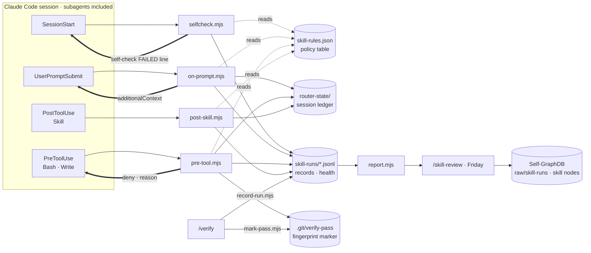
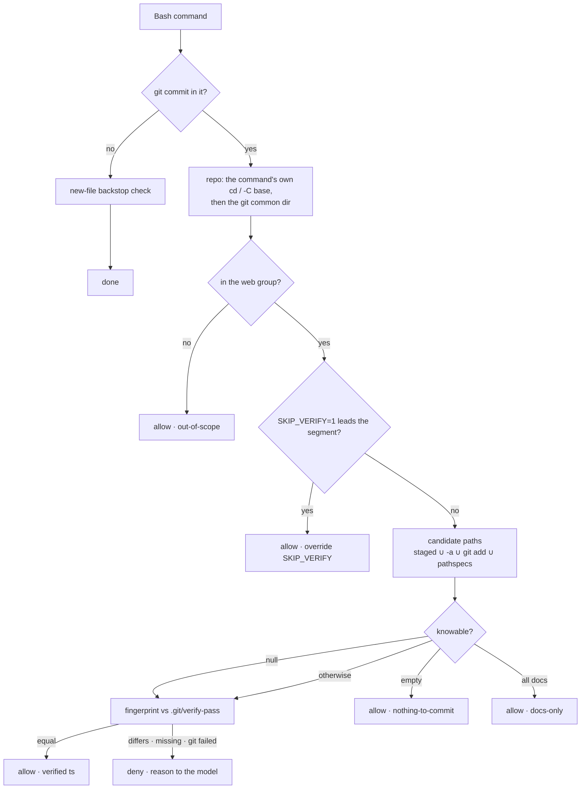

# skill router: the guide

The reference for every knob and every edge case is
[`router/README.md`](../README.md). This file is the walkthrough: what the
router does inside a session, how it decides, what it writes down, and how
that pile of records turns into a better skill on a Friday.

Korean: [`GUIDE.ko.md`](GUIDE.ko.md).

---

## 1. At a glance

**What.** Four Claude Code hooks plus one policy table make skill firing
deterministic. A skill's `description` is surfaced probabilistically, which
leaks in long sessions and in subagents; a hook runs every time.

**Why.** A carousel shipped broken on mobile because the change was verified
on desktop only and committed. "Verify before committing" has to be enforced
by a machine, not remembered. And every skill run has to leave a trace, or
there is nothing to improve the skills from.

**Where.**

| thing | path |
|---|---|
| code | `~/claude-skills/router/` |
| policy | `router/skill-rules.json` |
| session state | `~/.claude/router-state/` |
| records | `~/.claude/skill-runs/` |
| registration | `~/.claude/settings.json` |

**Live** since 2026-09-01 02:13 UTC, with three hooks; the fourth
(`SessionStart`) joined at the 05:41 UTC re-install. Every new session runs
all four.

The scripts hardcode no skill name, no repo name and no regex. Policy is
`skill-rules.json` alone, and the scripts read it and execute. Putting one
more skill under the router is one more row in that table.

---

## 2. Using it

### 2.1 Committing in a gated repo

Gated repos (`repo_groups.web`): `portfolio-html`, `studio-kyoung`,
`client-site-a`, `client-site-b`, `client-site-c`. Anywhere else
(Self-GraphDB, claude-skills, the Corp repos) the commit gate never
intervenes.

1. **Work.** Edit and stage freely. The gate only looks at commit time.
2. **Run `/verify`.** It runs git state, typecheck, tests and three viewport
   screenshots (on a mobile app, the repo's maestro flows instead), prints its
   table, and when the verdict is *safe* it writes
   `.git/verify-pass` with a fingerprint of the tree it just checked. A
   not-safe verdict clears the marker instead. Either way it appends one run
   record.
3. **`git commit`.** The `PreToolUse` hook reads the command, recomputes the
   fingerprint, and compares. Equal: it passes silently. Different: the
   commit is denied and the reason goes back to the model. Running `git add`
   after `/verify` is not a change; the fingerprint is staging neutral.
4. **If denied**, fix the tree and run `/verify` again. To skip deliberately:
   `SKIP_VERIFY=1 git commit -m "..."`. Only the environment assignment in
   front of the command counts; the same words inside the commit message do
   nothing. Put the reason in the message.

| situation | decision | `why` in the log |
|---|---|---|
| not a gated repo | allow | `out-of-scope` |
| `SKIP_VERIFY=1` leads the segment | allow | `override SKIP_VERIFY` |
| the commit carries no paths | allow | `nothing-to-commit` |
| every path is `.md/.mdx/.txt/.markdown` | allow | `docs-only` |
| marker fingerprint equals the live tree | allow | `verified <ts>` |
| no marker | deny | `marker missing` |
| the tree moved after the verify | deny | `tree changed since <ts>` |
| git failed, so no fingerprint | deny | `fingerprint unavailable (git failed)` |
| candidate set unknowable (command substitution) | falls through to the fingerprint check | one of the last four |

The denial the model receives (one line in the rule table, wrapped here
for width):

```
verify gate: no passing /verify for this exact tree (marker missing). Run the
verify skill first, then commit. Conscious override: SKIP_VERIFY=1 git commit
... (say why in the commit message).
```

Hooks apply to subagent tool calls too, so "the worker drew a table and
committed" is mechanically blocked.

### 2.2 Reminders

At `UserPromptSubmit` the `prompt` rules are matched against the first 4000
characters of the prompt; a hit injects one line into the model's context.
You do not see it, the model does. It too is a single line, wrapped here for
width:

```
[skill-router] This prompt asks to build a component/hook/util/feature. Invoke
the reuse-scout skill FIRST and cite its manifest before designing or writing
code: the repo probably already has part of this.
```

- **reuse-scout** (all repos). Sentences like "버튼 컴포넌트 하나 만들어줘",
  "add a useDebounce hook", "결제 화면에 로딩 상태 추가해줘". Korean noun
  first and English verb first are both covered. Word boundaries and guards
  keep "the build is failing on the login page" and "이 화면도 추가로
  확인해줘" out. Once per session, and silent once reuse-scout has run.
- **Backstop.** If the reminder was missed, the moment a file that does not
  exist yet is written under `components/ hooks/ lib/ utils/ modules/ app/
  screens/ features/`, by the `Write` tool or a `>` / `>>` / `tee` target,
  the reminder fires once more as context, without blocking. A target
  starting with `~` or containing `$` is unexpanded shell text and is skipped
  rather than spending the session's one reminder.
- **save-memory** (Corp repos only). Wrap-up phrasing: "오늘은 여기까지,
  정리하자", "let's wrap up". Its own guard is where `마감일` lives, so "이번
  스프린트 마감일 언제야?" does not match. Once per session, and silent once
  save-memory has run.
- **Self-echo guard.** A prompt containing `[skill-router]` is not evaluated
  at all, so the reminder's own words cannot re-trigger the rule that wrote
  them and burn the session's single reminder.
- **Harness-turn guard.** A prompt that starts as a `<task-notification>` or
  a `<system-reminder>`, or that carries `[SYSTEM NOTIFICATION - NOT USER
  INPUT]` in its first 200 characters, is not evaluated either, so a
  background task's own words cannot burn that reminder or bank an invoke
  nobody typed.

### 2.3 Run records

`~/.claude/skill-runs/<skill>.jsonl`, one JSON object per line, appended and
never edited in place. Five types, plus `health` in the router's own buffer.
Every line below is real output from the CLIs and hooks, generated into a
throwaway `SKILL_RUNS_DIR` for this guide.

A reminder is delivered, and its rule, pattern index and prompt excerpt are
written into the buffer of the skill it asked for:

```json
{"type":"remind","rule":"reuse-scout-prompt","delivery":"prompt","repo":"portfolio-html","session_id":"5f5e2a91","prompt_id":"p-01","pattern_index":1,"prompt_excerpt":"버튼 컴포넌트 하나 만들어줘","id":"reuse-scout-20260901T055632Z-79e8","ts":"2026-09-01T01:56:32.317-04:00","skill":"reuse-scout"}
```

The model then runs the skill, and the `Skill` hook classifies how it was
triggered. `router` means a reminder for that skill fired earlier in the same
session:

```json
{"type":"invoke","repo":"portfolio-html","session_id":"5f5e2a91","prompt_id":"p-02","trigger":"router","id":"reuse-scout-20260901T055632Z-ec62","ts":"2026-09-01T01:56:32.576-04:00","skill":"reuse-scout"}
```

A commit arrives with no marker behind it. `candidates` is how many paths the
commit would have carried:

```json
{"type":"gate","repo":"portfolio-html","session_id":"5f5e2a91","prompt_id":"p-03","decision":"deny","why":"marker missing","candidates":1,"docs_only":false,"marker_ts":null,"marker_age_s":null,"command_excerpt":"git commit -m \"feat: toast\"","id":"verify-20260901T055632Z-76e5","ts":"2026-09-01T01:56:32.788-04:00","skill":"verify"}
```

`/verify` finishes and writes its own line through `record-run.mjs`, carrying
the skill version and the git context of the tree it ran on:

```json
{"type":"run","version":"1.1.0","repo":"portfolio-html","cwd":"/.../repos/portfolio-html","session_id":"5f5e2a91","session_inferred":true,"prompt_id":null,"git":{"head":"90f88bb81da4","branch":"main","changed":1},"outcome":{"verdict":"safe","gates":{"git":"PASS","typecheck":"PASS","tests":"PASS","screenshots":"PASS"},"tiles":9,"routes":["/"],"duration_s":84},"caught":[],"id":"verify-20260901T055634Z-5504","ts":"2026-09-01T01:56:34.204-04:00","skill":"verify"}
```

The same commit, retried. `marker_age_s` is the gap between the passing
verify and the commit it finally let through:

```json
{"type":"gate","repo":"portfolio-html","session_id":"5f5e2a91","prompt_id":"p-05","decision":"allow","why":"verified 2026-09-01T01:56:33.615-04:00","candidates":1,"docs_only":false,"marker_ts":"2026-09-01T01:56:33.615-04:00","marker_age_s":1,"command_excerpt":"git commit -m \"feat: toast\"","id":"verify-20260901T055634Z-fe57","ts":"2026-09-01T01:56:34.664-04:00","skill":"verify"}
```

Later, `debrief` finds something that run missed and points at it by `ref`.
The run itself is never rewritten:

```json
{"type":"annotation","ref":"verify-20260901T055634Z-5504","repo":"portfolio-html","missed":"carousel mobile overflow","by":"debrief 2026-09-02","note":"tiles were desktop-only","id":"verify-20260901T055635Z-62d0","ts":"2026-09-01T01:56:35.158-04:00","skill":"verify"}
```

And the session self-check writes one `health` line per session start or
resume into `~/.claude/skill-runs/router.jsonl`, which is the router's own
buffer rather than a skill's:

```json
{"type":"health","ok":true,"checks":{"settings":true,"rules":true,"probe.on-prompt":true,"probe.pre-tool":true,"probe.post-skill":true,"node":true},"ms":449,"node":"v22.14.0","router_dir":"/Users/kyounghoonkim/claude-skills/router","id":"router-20260901T055636Z-a30a","ts":"2026-09-01T01:56:36.126-04:00","skill":"router"}
```

**Join keys.** `remind`, `invoke`, `gate` and `run` all carry `session_id`
and `prompt_id`, which is what makes separate buffers joinable: a `remind`
and a later `invoke` of the same skill in the same `session_id` is a reminder
that converted. `annotation` and `health` carry neither: an annotation points
at its run by `ref`, and a health line belongs to the router, not to a
session. `id` is every line's own identifier. `ts` is local time with an
offset, while `router.log` is UTC, so the two are never added up without
converting first.

**Privacy.** A prompt excerpt keeps the first 160 code points with
whitespace collapsed, a command excerpt keeps 120 of them, and the whole
prompt is never stored. Records live under `~/.claude/skill-runs/`, never
inside a repo, and never leave the machine. The only thing `/verify` writes
inside a repo is `.git/verify-pass`, which git ignores.

### 2.4 The session self-check

`selfcheck.mjs` runs on `SessionStart`, when a session starts or is resumed
into, and answers the question the log cannot: is the router still wired, and
does it still fire? A `/clear` or a compaction fires `SessionStart` again
inside a session whose install cannot have changed since the last check, so
those two sources are skipped: no probes, no `health` record, no log line.
Every other source runs, including one this router has never heard of, since
an allowlist here is how a check goes quiet. Six checks, about half a second,
silent while everything passes.

| check | what it proves |
|---|---|
| `settings` | `settings.json` parses, all four hooks are registered from THIS checkout, every `allow_skills` name is allowed, `env.SKILL_RUNS_DIR` is set |
| `rules` | the table loads, every reminder rule has a message, every group a rule names exists, `pretooluse_context` is one of the two valid values |
| `probe.on-prompt` | the prompt hook still turns the reuse-scout rule's own `sample` sentence into a reminder |
| `probe.pre-tool` | a new file under `components/` still draws the backstop, and an unverified commit in a gated repo is still denied |
| `probe.post-skill` | a `Skill` call still lands in a session ledger |
| `node` | Node 22 or newer. Informational: it is recorded and counted, but it never flips the verdict, because nothing about the router is broken by an old Node |

The three probes spawn the real hook scripts against a throwaway `HOME`,
state directory, records directory and git checkout, with
`SKILL_ROUTER_PROBE=1` set, so a probe can never write a real record and can
never re-enter the check. The four spawns run in parallel, which is what keeps
the whole thing inside a session start budget. Building that throwaway
checkout can itself fail (git missing, git failing, git hitting its timeout);
when it does, `probe.pre-tool` says it could not build the checkout rather
than reporting the commit gate broken, which is the one alarm this check must
never invent.

All green: nothing on stdout, one `health` record, one `health` log line. A
blocking failure: one line into the session naming each failed check with its
reason, and the same list in the record. A note on its own, an informational
check like `node` with nothing blocking behind it, is written into the record
flagged `informational` and counted by the weekly report under Health, but it
stays out of the session and leaves the verdict `ok`.

```
[skill-router] self-check FAILED: settings (PostToolUse: post-skill.mjs not
registered). Run /skill-router status; repair with /skill-router install.
```

The same six checks on demand, as a table. Exit 1 on a blocking failure; a
note alone prints a `⚠️` row under a `PASS` line and still exits 0:

```bash
node ~/claude-skills/router/selfcheck.mjs --cli
```

```
router self-check · /Users/kyounghoonkim/claude-skills/router · v22.14.0
✅ settings          4 hooks, 7 allow rules, SKILL_RUNS_DIR set
✅ rules             4 rules, 2 groups, additionalContext
✅ probe.on-prompt   reuse-scout-prompt reminded
✅ probe.pre-tool    new-file reminder + commit deny in portfolio-html
✅ probe.post-skill  verify invocation ledgered
✅ node              v22.14.0
PASS · 6 checks · 471ms
```

**Repair is explicit.** A failing check never rewrites `settings.json` by
itself; it tells you to run `/skill-router install`. Two reasons: a hook that
edits the settings file mid-session is a hook that can silently change what
the next session runs, and a settings change only takes effect in a new
session anyway, so an automatic repair would fix nothing in the session that
noticed. `SKILL_ROUTER_SELFCHECK=0` switches the check off for a session.

### 2.5 The Friday ritual: `/skill-review`

Detection is automatic; reinforcement is a decision, made once a week while
looking at numbers. `report.mjs` is the deterministic half.

```bash
node ~/claude-skills/router/report.mjs                                  # markdown, since the last review
node ~/claude-skills/router/report.mjs --since 2026-08-25T00:00:00Z --json
node ~/claude-skills/router/report.mjs --mark                           # close the window, print nothing else
```

The window runs from the `last` timestamp in
`~/.claude/router-state/review-watermark.json`, else the last seven days;
`--since` overrides both. `--mark` writes the watermark to now and prints the
one it replaced.

A real report, run against the throwaway buffer built above:

```
# skill router · weekly review
window 2026-08-25T05:56:42.908Z → 2026-09-01T05:56:42.908Z · 7 days · window from default · 8 records

totals · invoke 2 · remind 1 · run 1 · gate 2 · annotation 1

## reuse-scout
- invoke 1 · user 0 · router 1 · model 0
- remind 1 · converted 1 (100%)
  - reuse-scout-prompt: 1 sent, 1 converted

## verify
- invoke 1 · user 1 · router 0 · model 0
- run 1 · safe 1
  - version 1.1.0: 1 run · safe 1
  - gates.git: PASS 1
  - gates.typecheck: PASS 1
  - gates.tests: PASS 1
  - gates.screenshots: PASS 1
  - sums tiles 9 · duration_s 84
- gate 2
  - allow: verified 1
  - deny: marker missing 1
  - deny to allow cycles 1 · median marker age at allow 1s · median denies before the first allow 1 (a session that was never denied counts 0)
- annotation missed: carousel mobile overflow (ref verify-20260901T055634Z-5504, by debrief 2026-09-02)

## Candidates
- pattern-unused · reuse-scout-prompt #0 · (?:\b(?:re)?build\b(?!\s*(?:(?:is|was|isn|fails?|failing|fai

## Health
- self-check 1 ok · 0 failed
```

Two details worth noticing in that output. The allow bucket says `verified 1`
and not `verified 2026-09-01T01:56:33.615-04:00`: the gate writes the
marker's own timestamp into its reason, so the report strips a trailing ISO
timestamp before bucketing, otherwise every commit gets a bucket of its own
and the column reads as noise. And `pattern-unused` fired for pattern #0
because the sample prompt matched pattern #1, which is exactly the signal the
candidate is for.

The `Health` section counts the self-check history, and an informational
check that rode along on a passing record is counted there too, on its own
line, so a note nobody sees never stays unfixed:

```
## Health
- self-check 1 ok · 0 failed
  - notes: node 1
```

`Candidates` are threshold crossings, not opinions:

| kind | when it fires |
|---|---|
| `rule-never-converts` | a rule reminded 3+ times and the skill never ran after it |
| `gate-loop` | a session was denied 3+ times with no invoke and no run of the skill the gate asked for |
| `self-echo` | a reminder fired on a prompt that already was that skill's slash command |
| `pattern-unused` | a `prompt` pattern matched nothing all window, in a window that actually entered its scope |
| `version-regression` | a skill version came back `not-safe` more often than `safe`, over at least 3 runs |

`/skill-review` is the human half, and it runs in this order:

1. `selfcheck --cli`. FAIL stops the review: a hook that was not running left
   no records, and missing records read as a quiet week, which is the exact
   wrong conclusion.
2. `report.mjs --md`, read whole before any judgment is written.
3. Two sentences of reading per skill, then a candidate table where every
   "why" cell quotes a number from the report. It proposes; it never edits a
   `SKILL.md` or `skill-rules.json` on its own.
4. Graph writes into Self-GraphDB: this window's new record lines appended to
   `raw/skill-runs/<skill>.jsonl` deduped by `id`, one
   `graph/projects/<skill>-skill.md` node per tracked skill with a rewritten
   `현재 상태` block and one appended `강화 이력` bullet, the hub node
   `graph/projects/claude-skills.md` with an inbound link so it is not an
   orphan, an `INDEX.md` line per new node, and one `log.md` entry. Raw
   writes are append only and proved by `wc -l` growing by exactly the number
   of lines appended.
5. `report.mjs --mark`, only after the review is actually finished.

**The graph's only writer for the skill layer is Kyoung on a Friday, through
this skill.** There is no scheduled loop in v1. That is a decision, not an
omission: automatic memory writes are discretionary and quietly skipped, and
a ritual a human triggers is more reliable than an automatic one nobody
notices has stopped. What is automatic is *detection*, which is the part that
fails silently otherwise.

`/save-memory` ends by pointing at this ritual, and by writing its own `run`
line: the skill layer's own memory is these records and the Friday review,
not the auto-memory file.

### 2.6 The operator console: `/skill-router`

Reports only what a command in that turn printed, from two read-only
programs.

| subcommand | what it reads |
|---|---|
| (none), `status` | `status.mjs --md` then `selfcheck.mjs --cli` |
| `log [n]` | `~/.claude/router-state/router.log`, which rotates to `router.log.1` at 1 MB, so a window that reaches back far enough needs both |
| `rules` | the status card's rule block; `skill-rules.json` when the exact regex matters |
| `records [skill]` | the card's record counts, then a tail of `<runs dir>/<skill>.jsonl`, with the directory taken from the status card rather than assumed |
| `why-denied` | the `commit` + `deny` lines from both log files, decoded into a next move |
| `install` / `uninstall` | `install.mjs --dry-run` first, then the real run after an explicit yes |
| `doc` | this guide, the Korean one, and `router/README.md` |

```bash
node ~/claude-skills/router/status.mjs --md
node ~/claude-skills/router/status.mjs --json --cwd ~/portfolio-html --log 20
```

`status.mjs` writes nothing at all, not even a directory. It reports each of
the four hook entries found or missing **with the checkout it actually runs
from**, which is the failure a plain "the hooks are in the file" check
misses; the expected allow rules, with other `Skill(...)` allows counted
separately; the rule table row by row; this repo's name, whether a
`pre-commit` rule covers it, and its marker with the marker's age; the log
tail across the rotated file; the record files by type; and the last
self-check.

### 2.7 Knobs, diagnosis, limits

| you want to | command or file |
|---|---|
| see the install without changing it | `node ~/claude-skills/router/install.mjs --dry-run` |
| turn it off / back on | `install.mjs --uninstall` / `install.mjs` (backs the settings file up first) |
| add or remove a gated repo | one directory basename in `repo_groups.web` in `router/skill-rules.json` |
| add a reminder sentence | that file's rule `patterns` (case insensitive, Unicode), then run the suite |
| find out why a skill went quiet | `~/.claude/router-state/router.log`, six columns: `ts · event · rule · repo · decision · why`; it rotates to `router.log.1` at 1 MB, so a window that reaches back far enough needs both |
| run the canary | `cd ~/claude-skills && node --test 'router/test/*.test.mjs'` |

Quote the glob: the bare directory form is read as a module path on Node 22
and fails without running anything.

**What the gate cannot see.** Commits git makes on its own behalf (`revert`,
`merge`, `cherry-pick`, `rebase --continue`, `stash`), a commit inside a
script or an npm target, wrappers that hide the command from the parser
(`timeout`, `bash -c`, `eval`, `xargs`, a git alias), commits typed in your
own terminal, and anything outside `repo_groups.web`. This is a gate on an
agent claiming done, not a git `pre-commit` hook and not a security boundary.
Every failure direction is "the gate did not fire", which was the state of
the world before the router, never "the session broke".

---

## 3. Mechanism

### 3.1 Architecture



Each hook reads JSON on stdin (session id, cwd, and the prompt or the tool
input) and answers with one JSON line on stdout, or with nothing. **Allow is
"no output"**: the router never emits `permissionDecision: allow`, so it can
never route around Claude Code's normal permission flow.

### 3.2 The commit gate decision



The contract that holds it together: when git fails, the candidate set and
the fingerprint are `null`, not `[]`. The moment "cannot tell" reads as
"nothing to commit" the gate fails open, so `null` always falls through to
the fingerprint check, and a `null` fingerprint denies.

### 3.3 The tree fingerprint

A SHA-256 over the exact tree `/verify` saw:

- `HEAD` (the sentinel `EMPTY` when the branch is unborn).
- Each entry of `git status --porcelain=v1 -z --untracked-files=all`,
  **normalized**: the
  status code collapsed to `D` (deleted) or `C` (changed), a rename unfolded
  into new path `C` plus old path `D`, then sorted. A `git add` that turns
  ` M` into `M ` therefore leaves the fingerprint alone.
- For a file that exists in `HEAD`, its **content** (the blob hash from
  `git hash-object --stdin-paths`), so a same length edit still moves the
  fingerprint. For a file that does not (untracked, or newly added to the
  index) and for any file over 8 MB, a `size:mtime` stamp instead: its
  content is new by definition, and reading it is what costs. One real
  checkout carries 456 MB of untracked images, which is why this rule exists
  and why the gate went from about 2.1 s to about 0.39 s.
- Each file's mode, so a `chmod +x` on an already dirty file is a change.

```json
{ "fingerprint": "17cb816dfd8f…", "ts": "2026-09-01T01:56:33.062-04:00",
  "gates": {"git":"PASS","typecheck":"PASS","tests":"PASS","screenshots":"PASS"},
  "routes": ["/"] }
```

The marker lives in the worktree's own git directory, which git ignores and
never commits, so two worktrees of one repository each need their own passing
`/verify`. Repo identity comes from the parent basename of
`git rev-parse --git-common-dir`, so a linked worktree still answers
`portfolio-html` and stays in its group, and the base directory is resolved
through symlinks so a `/tmp` to `/private/tmp` checkout does not push every
pathspec outside the repo.

### 3.4 The command parser

| command shape | what the parser does |
|---|---|
| `cd web && git add … && git commit …` | reads segment by segment (`&&`, `;`, `\|`, newline) and remembers a preceding `cd` as the base of each add and commit; `(cd … && git commit …)` subshells too |
| `git -C repo commit`, `cd web && git -C .. commit` | composes `-C` with the preceding `cd` (joined when relative); an unresolvable base (`$VAR`, a failed cd) falls back to the hook's repo and pathspecs resolve there |
| `git commit -m "x" web/app/page.tsx` | the commit's own pathspecs join the candidate set, so committing an unstaged file by pathspec does not leak |
| `git add "web/my file.tsx"`, `git add web/*.ts` | quote aware tokenizer; globs expand against the changed file list, and expand conservatively to all changed files when nothing matches |
| `git add "$(…)/x"`, `--pathspec-from-file` | candidate set **unknown**, so the fingerprint decides |
| heredoc and herestring | a heredoc body is not read as commands, so `git commit` text inside one is data; an opener counts only outside quotes, in a redirect position, and not as `<<<` |
| `SKIP_VERIFY=1 …` | recognized only at a segment's start, in an environment assignment position, on a copy with quotes and heredoc bodies stripped; the same words in a commit message do nothing |

### 3.5 The ledger and trigger classification

`~/.claude/router-state/<session_id>.json` holds what this session has
already been reminded about (`reminded`), which skills you typed as slash
commands (`user_invoked`), and which skills ran (`skills_ran`). Hooks overlap
on parallel tool calls, so a save re-reads the file and merges rather than
overwriting, and writes through a temp file and a rename. Files older than
7 days are pruned.

| when the `Skill` tool ran | trigger | record |
|---|---|---|
| you typed `/skill` in the same `prompt_id` | `user` | none: the prompt hook already wrote the `invoke` |
| a reminder for that skill fired earlier this session | `router` | `invoke` |
| anything else | `model` | `invoke` |
| `tool_response.success === false` | none | not counted as a run at all (no ledger, no record, `skip` in the log), otherwise a permission denial would switch that session's reminders off for good |

A typed slash command never reaches the `Skill` tool; it arrives as the raw
prompt text (`/verify no-serve`), which is why the `user` trigger is written
by the prompt hook. That was measured with a probe session, not assumed.

### 3.6 Fail open, and what it costs

- Every hook exits 0 no matter what happens inside it, and a failure inside
  one produces no output at all (the normal path still emits: a deny, an
  `additionalContext`). An exit code other than 0 or 2 raises a notification
  at the user, so failure has to be *quiet*. The worst a router bug can do is switch the router off.
- stdout is written completely with `fs.writeSync` (macOS pipes are async, so
  `process.exit` right after a write can truncate it); stdin is abandoned
  after 2 seconds; the hook timeout is 5 seconds, 10 for the self-check.
- A broken policy file logs one `rules-load-failed` line and lets the call
  through: fail open, but not fail silent.

| measured | cost |
|---|---|
| ordinary Bash tool call | about 30 ms |
| prompt | about 80 ms |
| commit gate on the real `portfolio-html` (180 dirty paths) | about 0.39 s |
| the same gate before the fingerprint rule was fixed | about 2.1 s |
| session self-check | 449 ms, 471 ms and 676 ms across this session's runs |

### 3.7 The file map

```
~/claude-skills/router/
  skill-rules.json      policy: repo_groups · docs_only · pretooluse_context
                        · track_skills · allow_skills · rules[]
  on-prompt.mjs         UserPromptSubmit: typed-skill invoke records,
                        prompt reminders, self-echo guard
  pre-tool.mjs          PreToolUse Bash|Write: commit gate, new-file backstop
  post-skill.mjs        PostToolUse Skill: ledger, trigger classification,
                        invoke records
  selfcheck.mjs         SessionStart: six checks, health records, --cli
  report.mjs            weekly aggregation, watermark
  status.mjs            read-only console behind /skill-router status
  record-run.mjs        the CLI a skill calls last: run / annotation records
  mark-pass.mjs         the CLI /verify calls: write the marker, or --clear
  install.mjs           idempotent settings merge (--dry-run, --uninstall)
  probe.mjs             raw hook payload logger
  lib/io.mjs            failOpen · readStdin · emit · log, rotated at 1 MB
  lib/rules.mjs         table load · repo identity · scope · pattern matching
  lib/git.mjs           git plumbing · repo root · fingerprint · marker
  lib/commit.mjs        the parser: segments · cd/-C · pathspecs · globs
                        · heredoc masking · SKIP_VERIFY
  lib/gate.mjs          decideCommit · decideBackstop
  lib/ledger.mjs        session ledger (merge on write, atomic, prune)
  lib/prompt.mjs        detectUserSkill · planReminders
  lib/records.mjs       jsonl append · ids · version · session inference
  lib/report.mjs        the weekly arithmetic
  lib/paths.mjs         where everything lives, and the env overrides
  lib/args.mjs          the tiny flag parser the CLIs share
  lib/entries.mjs       the hook registration table, shared by install and
                        selfcheck, so a health check cannot drift from it
  test/*.test.mjs       155 tests: temp git repos and spawned hook processes
skills/verify/references/{mark-pass,record-run}.mjs   one-line shims
skills/reuse-scout/references/record-run.mjs
```

What `install.mjs` writes into `~/.claude/settings.json`:

| key | value |
|---|---|
| `hooks.UserPromptSubmit` | `node ~/claude-skills/router/on-prompt.mjs`, no matcher, timeout 5 |
| `hooks.PreToolUse` | matcher `Bash\|Write`, `pre-tool.mjs`, timeout 5 |
| `hooks.PostToolUse` | matcher `Skill`, `post-skill.mjs`, timeout 5 |
| `hooks.SessionStart` | no matcher, `selfcheck.mjs`, timeout 10 (longer: it spawns the other three before answering) |
| `permissions.allow` | `Skill(verify)`, `Skill(reuse-scout)`, `Skill(skill-router)`, `Skill(skill-review)`: a skill with `allowed-tools` otherwise stops at a permission prompt, which auto-denies in non-interactive runs |
| `env.SKILL_RUNS_DIR` | `~/.claude/skill-runs` |

Every write is idempotent, so a second run prints `router: nothing to
change`, and the existing file is copied to `settings.json.bak-<timestamp>`
first. Hooks are captured at session start, so an install takes effect in the
next session, never the current one.

---

## 4. What the reinforcement loop eats

The records exist to answer five questions, and each one is answered by a
different join. This is the whole reason `remind`, `invoke`, `gate` and `run`
carry `session_id` and `prompt_id`; an annotation joins to its run by `ref`
instead, and a health line belongs to the router rather than to a session.

| question | what answers it |
|---|---|
| Is the router working at all? | `invoke.trigger`. A skill only ever invoked with `trigger: router` is one the habit has not formed for; `user` is you reaching for it; `model` is the model choosing it unprompted. |
| Do reminders convert? | a `remind` followed by an `invoke` of the same skill in the same session. A `remind` with nothing after it is one the model ignored, and `pattern_index` plus `prompt_excerpt` say which pattern and which wording produced it, so a rule that never converts gets rewritten instead of guessed at. |
| Does the gate cost rounds? | the `gate` lines replayed per session: deny, then a `run`, then an allow whose `marker_age_s` is the gap. `cycles` counts how often that happened and `median_denies_before_first_allow` how many denies it took. A long run of allows with `docs_only: true` says the gate is mostly waving documentation through and covering less than it looks. |
| Is a new version of a skill better? | `run.version` grouped with the `annotation.missed` lines that point at those runs by `ref`. That ratio is the only honest measure of whether an edit to a `SKILL.md` improved anything. |
| Is the router itself alive? | `health`. One line per session start or resume, and the failures dated, so a week with no records can be told apart from a week the router was off. A `/clear`-heavy week has fewer health lines than sessions, so read the count as checks run, not as sessions. |

### What is deliberately not captured

- **Full prompts.** 160 code points, whitespace collapsed, and only for the
  prompt that actually produced a reminder.
- **Commands.** 120 code points of the command that reached the gate.
- **Transcripts, diffs, file contents: none.** The loop reads transcripts
  separately, through `debrief`, which is also what writes the `annotation`
  lines. Keeping them out of the buffers is what keeps the buffers small,
  joinable and safe to append to raw storage in the graph.
- Nothing is uploaded anywhere. The buffers are local JSONL files.

### The gaps that remain

Worth stating plainly, because a number nobody doubts is a number nobody
checks:

- **Conversion is same session only.** A reminder acted on the next morning
  is counted as ignored.
- **Conversion measures firing, not quality.** That the skill ran after a
  reminder says nothing about whether the answer got better.
- **`run` lines depend on the skill remembering to write one.** An `invoke`
  with no `run` beside it is exactly what a skill that quit before finishing
  looks like, which is a useful signal but not a measurement of what
  happened.
- **Misses only exist once somebody notices.** `annotation` lines come from
  `debrief`. A miss nobody debriefs is invisible, so the catch rate is really
  the catch rate of things that were later noticed.
- **The gate only records what it saw.** Commits made through a script, a
  wrapper, or your own terminal leave nothing at all, so gate coverage always
  looks better in the report than it is.
- **`session_id` on a `run` is inferred**, from the newest ledger for the
  same repo within three hours. Two sessions in one repo at once can be
  joined wrong; `session_inferred: true` is the flag that says so.
- **Hook latency is not recorded.** The numbers in 3.6 were measured by hand.

---

## 5. How it was built

From one handoff line on the evening of 2026-08-31 ("스킬 자동-invocation
타이밍 시스템: 내가 콜 안 해도 알아서") to live before dawn. The human hands
touched four decisions and the approvals; the rest was the orchestrator
dispatching Opus workers and reviewers.

**Decision 1, how hard.** `/verify` is a hard gate in web repos only.
Self-GraphDB and the headless agents (keeper, scout) are untouched.

**Decision 2, when.** reuse-scout fires at prompt time plus a write backstop,
both soft, neither blocking.

**Decision 3, the roster.** verify, reuse-scout, save-memory. One table row
each to extend.

**Decision 4, where the records live.** "Leave a mark every time it runs, use
it like a node, so the skill itself gets stronger." The answer was the raw,
wiki, schema three layers applied to skills: raw is the local JSONL buffer,
wiki is one node per skill written by the weekly ritual, schema is the
`SKILL.md` itself plus its version. The graph is written by the ritual alone.

The pipeline:

1. **Brainstorm, then spec.** Three questions produced the four decisions and
   `docs/superpowers/specs/2026-08-31-skill-router-design.md`. Hook facts
   came from official documentation, not memory, and the three facts the
   documentation did not settle were pinned as "measure in task 0".
2. **Plan.** 13 tasks, each carrying its real code and its real tests.
3. **Task 0, the probe.** A real session opened with
   `claude -p --settings probe.json` measured three things: the `Skill` tool
   does fire hooks (`tool_input = {skill, args}`), `PreToolUse` can inject
   `additionalContext` without an `allow`, and a typed slash command arrives
   as raw prompt text without passing the `Skill` tool. Those three facts
   decided how the backstop is delivered, how triggers are classified, and
   who writes the `user` invoke record.
4. **SDD execution.** One fresh opus-worker per task under a brief and report
   contract, then an opus-reviewer for spec compliance and quality
   ("reproduce it and quantify it"), then a fix round, then a scoped
   re-review. Roughly 14 review rounds. Reviewers built temp repos and piped
   stdin into the hooks to reproduce each bypass.
5. **Install and go live.** The real install happened only after the gate
   fixes landed, verified by an install and uninstall round trip on a copy
   that came back byte identical. The first live prompt confirmed the
   injection.
6. **Final full review, one fix wave of 8 commits, two micro fixes.** The
   wave introduced one regression (heredoc handling order) and the re-review
   caught it the same round.
7. **Live smoke, run by the orchestrator directly.** In a scratch clone:
   deny, mark-pass, allow; out of scope unaffected; one reminder then
   silence; a real reuse-scout run recorded; the gate holding for a subagent
   commit and inside a linked worktree; a real `/verify` round trip.

| number | |
|---|---|
| 13 | tasks, each independently reviewed |
| ~14 | fix rounds, plus the final review, the wave and two micro fixes |
| 52 | commits on `router` ahead of `main` before this docs commit |
| 155 | tests, all green (`node --test 'router/test/*.test.mjs'`) |
| ≈5.7 h | agent runtime (≈62 dispatches, ≈5.2M tokens) |
| ~40 min | Kyoung's own time, on decisions and approvals |

### The bypasses, closed in order

Most of the time went here. The gate reads a command as text, so a bypass is
a parser class problem. Reviewers reproduced one per round, and how each was
closed became a contract.

**T5 R1.** `SKIP_VERIFY=1` inside a commit message switched the gate off, so
only an environment assignment at a segment's start counts now. A failed
`hash-object` made the fingerprint content blind, so a git failure became
`null` and `null` denies. `cd`, `-C`, globs and quoted `git add` were falling
out of the candidate set, so base composition, a quote aware tokenizer and
glob expansion went in, along with the commit's own pathspecs.

**T5 R2.** A `"$(…)"` token emptied the candidate set and read as "nothing to
commit", so a command substitution now makes the set unknown and the
fingerprint decides. Quote blind splitting kept a `; SKIP_VERIFY=1` inside a
message alive, so the decision moved to a copy with quotes and heredoc bodies
stripped.

**T6 R1 to R4.** `cd repo && git commit` was judged against the hook's cwd,
so the repo now comes from the command's own `cd`. `cd ~/repo`, `$HOME` and
`cd web && cd ..` were unresolvable, so those fall back to the hook's repo
and a leading `~` is expanded. The expanded base was not reaching the
candidate set, so it does now. A base belonging to no repo emptied the set,
so the fallback resets the base too.

**Final review.** Six at once, fixed in the wave: an empty candidate set in a
symlinked clone (realpath the base), a relative `-C` after a `cd` discarding
the `cd` (compose them), a missed `(cd …)` subshell (recognize it), the gate
not firing at all inside a linked worktree (identity through the common git
dir), a `docs/` directory whitelist letting `docs/Widget.tsx` through
(extension only `docs_only`), and untracked content hashing costing 2.1 s
(size and mtime stamps).

**Wave re-review.** Moving heredoc body removal ahead of the segment loop
deleted real commits after a `<<<` herestring or a quoted `<< WORD` mention.
The opener was narrowed to a redirect position, outside quotes, not `<<<`;
that fix then missed the second of two openers on one line, which took one
more hoisted line.

**Post-launch steer 1: the records were too thin.** Kyoung's read of the
first live records was that they could not answer the questions the loop
would have to ask. That produced v1.1 of the record layer: `remind` and
`gate` became record types of their own (with the rule, the pattern index and
the prompt excerpt on one side, and the decision, the candidate count, the
marker timestamp and age on the other), and `run` gained the git context
(`head`, `branch`, `changed`) and an optional `--prompt-id`. Five types
instead of three.

**Post-launch steer 2: silence has to detect itself, and the loop is a
ritual.** The second steer was that a router which quietly stops working is
the real failure mode, and that a scheduled weekly loop is not the answer:
detection must be automatic, reinforcement must be a human decision. That
produced the `SessionStart` self-check with its three probes and four
spawns,
`report.mjs` and its deterministic candidates, `status.mjs` as a read-only
console, the `/skill-router` operator skill and the `/skill-review` Friday
ritual with its graph writes. It also produced the rule that a self-check
never repairs itself: it says what broke and names the command.

---

## 6. What comes next

- **Kyoung's own hands.** Merge or leave the `router` branch (merging changes
  nothing at runtime: the symlinks and the hook paths point at the same
  checkout either way), and the first real `/verify` to commit round trip in
  daily work.
- **The first Friday.** The first `/skill-review` creates the hub node and
  one node per tracked skill, and from then on every window has a baseline to
  be read against.
- **Tuning by log, not by feel.** If a reminder is noisy or silent, the
  `remind` lines and the trigger ratio (`user` / `router` / `model`) say
  which pattern to change, and the report's `pattern-unused` and
  `rule-never-converts` candidates name it outright.

The spec and the plan live in the private Self-GraphDB repo, at
`docs/superpowers/specs/2026-08-31-skill-router-design.md` and
`docs/superpowers/plans/2026-08-31-skill-router.md`. The reference in this repo
is [`router/README.md`](../README.md).
